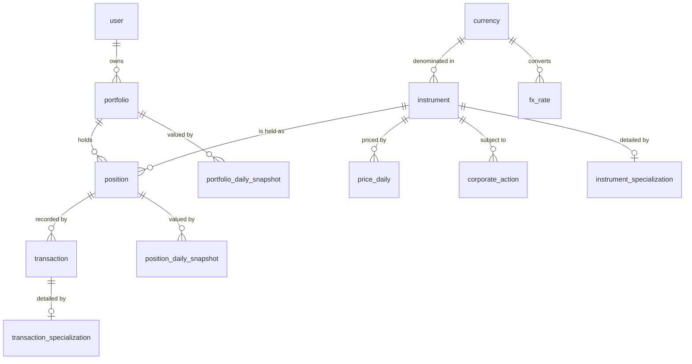
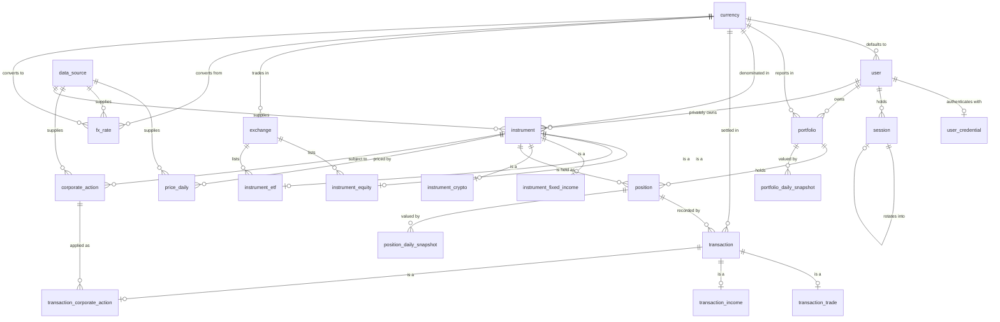

# ValueTracker — Architecture

## Database Model

This document is the **system-wide** view of ValueTracker's data model: the
design decisions that span modules, the complete entity-relationship diagram,
the invariants no single module owns, and the extensions deliberately deferred.

It deliberately does **not** define individual entities. Each table's columns,
constraints, business rules and worked examples live in the `SPEC-*.md` file for
the module that owns it — see [§7](#7-where-each-entity-is-specified). Keeping a
second copy here is how the two drift apart; this file holds only what no single
module can.

---

## 1. Purpose & Scope

ValueTracker lets a person track several investment portfolios, each holding
instruments of mixed classes, and see how those holdings gain or lose value over
time.

### In scope

- Multiple portfolios per user, each with its own objective and reporting currency.
- Mixed asset classes within a portfolio: fixed income, stocks, ETFs, cryptocurrency.
- Class-specific attributes (a fixed-income paper has a rate and a maturity date;
  a stock has a ticker and an exchange) modelled as first-class structure.
- Holdings entered as **transactions**: purchases, disposals, income events and
  corporate actions.
- Daily closing prices for variable-income instruments, and daily FX rates, so
  gains and losses can be computed and charted over any date range.
- Multi-currency holdings reported in the portfolio's base currency.

### Explicitly deferred

Not modelled in v1, discussed in [§9 Deferred Extensions](#9-deferred-extensions):
cash accounts and external contributions/withdrawals, FIFO tax lots, benchmark
comparison, target asset allocation, and intraday prices.

### Notation

The model is **engine-agnostic**. Attribute types are conceptual — `uuid`,
`string`, `decimal`, `date`, `timestamp`, `int`, `boolean` — and map to whatever
the chosen engine offers. Two constraints are non-negotiable regardless of engine:

- **Monetary and quantity values use exact decimal types, never binary floating
  point.** Suggested precision: `decimal(24,8)` for quantities (crypto needs the
  scale), `decimal(20,6)` for prices and amounts, `decimal(20,10)` for FX rates.
- **Every date that identifies a market observation is a calendar date, not a
  timestamp** — a daily close belongs to a trading day, not to an instant.

---

## 2. Design Decisions

| # | Decision | Choice | Rationale | Rejected alternative |
|---|---|---|---|---|
| 1 | Class-specific attributes | **Class-table inheritance** | A base `instrument` table holds what every instrument shares; one 1:1 specialization table per class holds what only that class has. Attributes stay typed and constraint-enforceable — nothing stops the database from requiring a maturity date on a fixed-income row while forbidding it on a stock. | Single table with a JSONB blob, or one wide table of mostly-NULL columns. Both push all validation into application code. |
| 2 | Price granularity | **Daily close** | ~252 rows per instrument per year is negligible volume, and weekly/monthly series are derived by downsampling. The reverse — reconstructing daily detail from weekly rows — is impossible, so daily keeps every future option open at almost no cost. | Weekly-only, which permanently discards intra-week detail. |
| 3 | Currency | **Multi-currency with FX rates** | Instruments and transactions carry their own currency; each portfolio declares a base currency for reporting; `fx_rate` supplies historical conversion. | Single-currency. Retrofitting currency into a live schema means touching every monetary column and backfilling every historical rate. |
| 4 | Event scope | **Trades, income events, corporate actions** | These are the three event families that change either quantity or realised return. | Cash accounts and transfers — deferred (see [§9](#9-deferred-extensions)). |
| 5 | Security identity | **Shared instrument catalog, separate from holdings** | `instrument` is the security; `position` is a portfolio's holding of it. PETR4's price history is stored once and read by every user, giving market-data ingestion a single row to write. | An asset owned by each portfolio, which duplicates identical price history per portfolio and per user. |
| 6 | Cost basis | **Weighted average** | Matches how Brazilian brokers report and what most investors expect. Basis is derived from the transaction ledger; no lot tracking required. | FIFO tax lots — correct for US-style tax reporting, but adds `tax_lot` and lot-consumption tables that v1 does not need. |
| 7 | Valuation for charts | **Daily snapshot tables** | A multi-year chart becomes one indexed range scan instead of replaying the whole ledger against price history on every request. | Deriving on the fly, which degrades sharply as history grows. |
| 8 | Database engine | **Undecided — model stays engine-agnostic** | The model is expressed conceptually so the engine choice stays open. | Committing to vendor DDL before the runtime stack is chosen. |

---

## 3. Model Shape

The model separates into three layers, and the separation is load-bearing.

**Reference & market data — shared, system-owned.**
`currency`, `exchange`, `data_source`, `instrument` and its specializations,
`price_daily`, `fx_rate`, `corporate_action`. Written by ingestion jobs, read by
every user.

**Ownership & ledger — user-owned, the source of truth.**
`user`, `portfolio`, `position`, `transaction` and its specializations. Every
number the system reports must be reproducible from this ledger plus market data.

**Derived — cache, always rebuildable.**
`position_daily_snapshot`, `portfolio_daily_snapshot`, and the cached
`quantity` / `average_cost` / `cost_basis` columns on `position`. Nothing here is
authoritative. A rebuild job regenerates all of it from the two layers above.

### Two structural points worth stating explicitly

**Private instruments.** A CDB issued by one bank and bought by one user is not a
public security, but it still needs the instrument shape: a type, a currency,
class-specific attributes, possibly a price series. This is handled with a
nullable `instrument.owner_user_id` — `NULL` means the shared public catalog,
non-null means an instrument private to that user. Fixed income therefore reuses
the same structure as listed securities instead of needing a parallel one.

**Corporate actions are modelled at two levels, deliberately.**
`corporate_action` hangs off `instrument` and records the *market fact*: a 1:4
split on this date, affecting everyone who holds the security.
`transaction_corporate_action` hangs off `position` and records the *application*
of that fact to one holding: this portfolio's 100 shares became 400, average cost
divided by four, total basis unchanged. Without the instrument-level event, an
ingestion feed has nowhere to write. Without the position-level row, quantity and
cost basis silently break the first time an instrument splits.

---

## 4. Conceptual Overview

The core entities and how they relate, without attributes.

The two `_specialization` boxes are placeholders standing in for the concrete
subtype tables, specified in [`SPEC-catalog.md`](./SPEC-catalog.md) and
[`SPEC-ledger.md`](./SPEC-ledger.md).

---

## 5. Complete ER Diagram

All entities and relationships, without attributes.

---

---

## 6. Cross-Cutting Invariants

Rules that no single module owns. Module-specific rules live in that module's
spec; these constrain the model itself.

### 6.1 Currency conversion is always historical

Every monetary amount carries its own `currency_code`. Conversion to the
portfolio's base currency uses the rate **at the date of the event**, captured in
`transaction.fx_rate_to_base` at write time. Never convert a historical amount
using today's rate — doing so makes past values drift with the exchange rate.

For valuation, a given day's `market_value_base` uses that day's `fx_rate`, so a
chart correctly reflects both price movement and currency movement.

### 6.2 Exact decimals, everywhere, without exception

Monetary and quantity values use exact decimal types end to end — in the
database, in the application, and on the wire. This is restated in `SPEC.md`
§Boundaries as a hard prohibition on `number` and `parseFloat`, and in
`SPEC-reporting.md` as the rule that clients format but never compute.

### 6.3 Derived data must be rebuildable

No cached or snapshot value may be the only place a fact lives. `position`'s
cached columns and both snapshot tables must be reproducible by replaying the
ledger and market data. A value that cannot be rebuilt is a defect, not an
optimisation.

---

## 7. Where Each Entity Is Specified

| Entity | Owning module | Specification |
|---|---|---|
| `user`, `user_credential`, `session` | `identity` | [`SPEC-identity.md`](./SPEC-identity.md) |
| `currency`, `exchange`, `data_source` | `catalog` | [`SPEC-catalog.md`](./SPEC-catalog.md) |
| `instrument` + `_equity`, `_etf`, `_fixed_income`, `_crypto` | `catalog` | [`SPEC-catalog.md`](./SPEC-catalog.md) |
| `portfolio` | `portfolio` | [`SPEC-portfolio.md`](./SPEC-portfolio.md) |
| `position`, `transaction` + `_trade`, `_income`, `_corporate_action` | `ledger` | [`SPEC-ledger.md`](./SPEC-ledger.md) |
| `corporate_action`, `price_daily`, `fx_rate` | `market-data` | [`SPEC-market-data.md`](./SPEC-market-data.md) |
| `position_daily_snapshot`, `portfolio_daily_snapshot` | `valuation` | [`SPEC-valuation.md`](./SPEC-valuation.md) |
| — (read layer, owns no tables) | `reporting` | [`SPEC-reporting.md`](./SPEC-reporting.md) |

Cost-basis arithmetic and the worked examples that verify it are in
`SPEC-ledger.md`. Fixed-income accrual and snapshot idempotency are in
`SPEC-valuation.md`.

## 8. Volumetrics & Indexing

Row counts are small enough that no exotic strategy is needed at launch, but two
tables grow linearly with time and deserve attention.

| Table | Growth driver | Order of magnitude |
|---|---|---|
| `price_daily` | instruments × trading days | ~252 rows/instrument/year → 5,000 instruments over 10 years ≈ **12.6M rows** |
| `fx_rate` | currency pairs × days | ~365 rows/pair/year → negligible |
| `position_daily_snapshot` | positions × days | 10,000 positions × 365 ≈ **3.65M rows/year** |
| `portfolio_daily_snapshot` | portfolios × days | ~365 rows/portfolio/year → negligible |
| `transaction` | user activity | Hundreds per portfolio per year |

### Access paths that matter

| Query | Supporting index |
|---|---|
| Chart an instrument over a date range | `(instrument_id, price_date)` — the PK, already ordered correctly for a range scan |
| Chart a portfolio over a date range | `(portfolio_id, snapshot_date)` — the PK |
| Latest close for a set of instruments | `(instrument_id, price_date DESC)` |
| A portfolio's current holdings | `(portfolio_id)` on `position`, with `closed_at IS NULL` |
| A position's ledger in order | `(position_id, trade_date)` on `transaction` |
| Convert on a date | `(base_currency_code, quote_currency_code, rate_date)` — the PK |
| Re-import idempotency | `(position_id, external_ref)` |

Composite primary keys on the two time-series tables are deliberately ordered
`(entity, date)` so that the most common query — one entity across a date range —
is a single contiguous scan.

`price_daily` and `position_daily_snapshot` are the candidates for range
partitioning by date if and when they outgrow single-table handling. Nothing in
the model needs to change to adopt it later.

---

## 9. Deferred Extensions

Deliberately excluded from v1, with the consequence of each exclusion noted.

**Cash accounts and external contributions.** There is no cash entity, so the
model cannot distinguish "the portfolio grew because it gained value" from "the
portfolio grew because more money went in". Buys and sells serve as a proxy for
flows, which makes time-weighted return approximate and true money-weighted
return (IRR) unavailable. Adding a `cash_account` and a `cash_movement` entity,
plus deposit/withdrawal transaction types, closes this gap — worth doing before
any return-vs-benchmark reporting is promised.

**FIFO tax lots.** Weighted average covers reporting for the target market. A
`tax_lot` table plus lot-consumption rows on sales would be needed for
jurisdictions requiring specific-lot or FIFO accounting. The transaction ledger
already carries enough information to reconstruct lots retroactively.

**Benchmarks.** Comparing a portfolio against IBOVESPA or CDI needs a benchmark
series and a portfolio-to-benchmark association. The `instrument` +
`price_daily` structures can host an index series directly; only the association
is missing.

**Target allocation.** Tracking a desired split across asset classes and flagging
drift needs an `asset_class` lookup and a `portfolio_allocation_target` table.

**Intraday prices.** Only warranted if live intraday charts become a requirement;
it multiplies market-data volume by orders of magnitude.

**Materialized weekly/monthly rollups.** Multi-year charts currently downsample
from `price_daily` and the snapshot tables at query time. If that becomes slow,
pre-aggregated rollup tables are the next step — the daily source of truth makes
them safe to add at any point.
