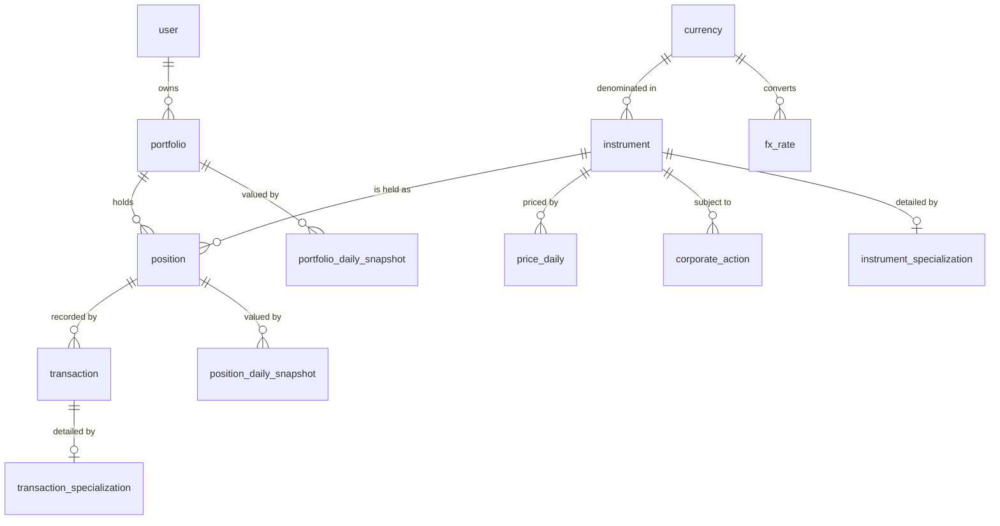
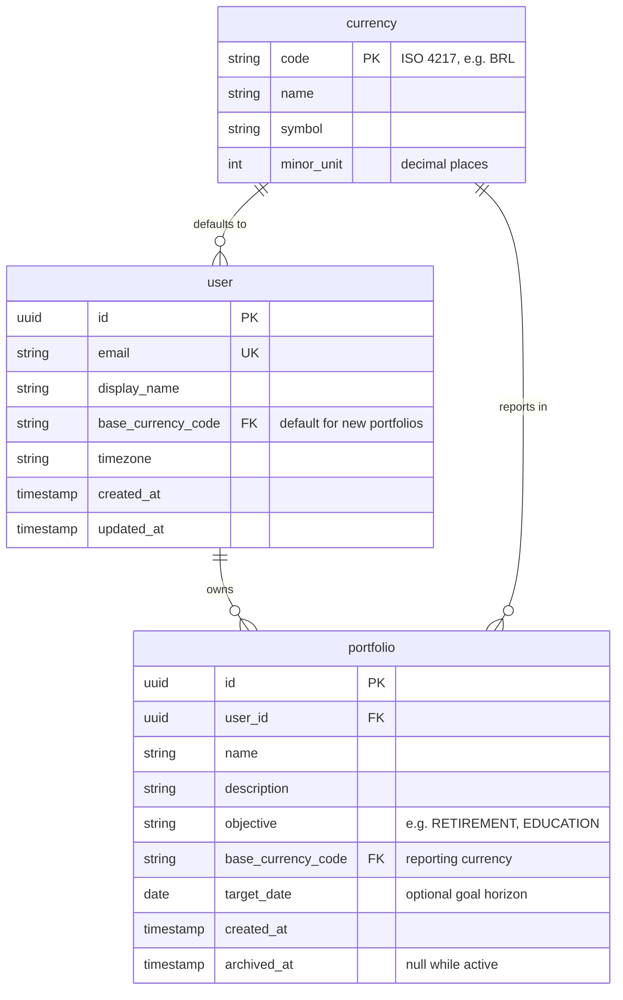
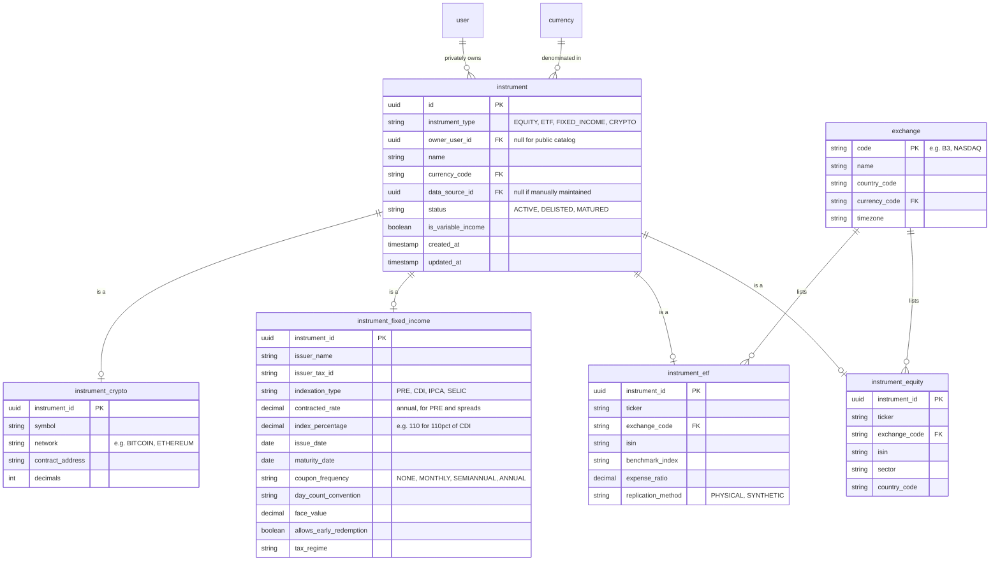
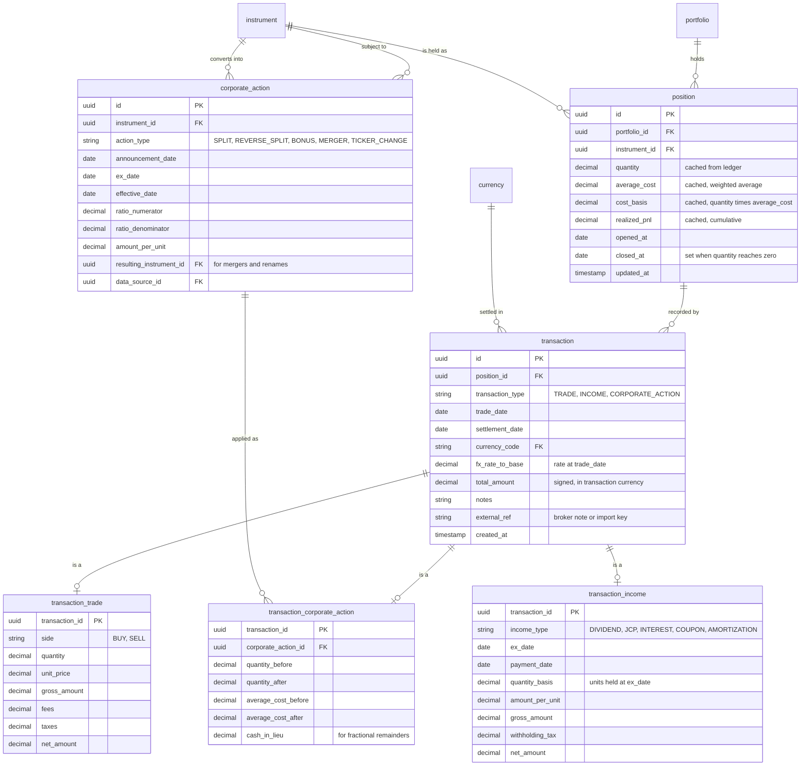
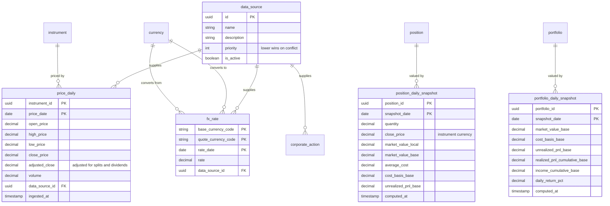
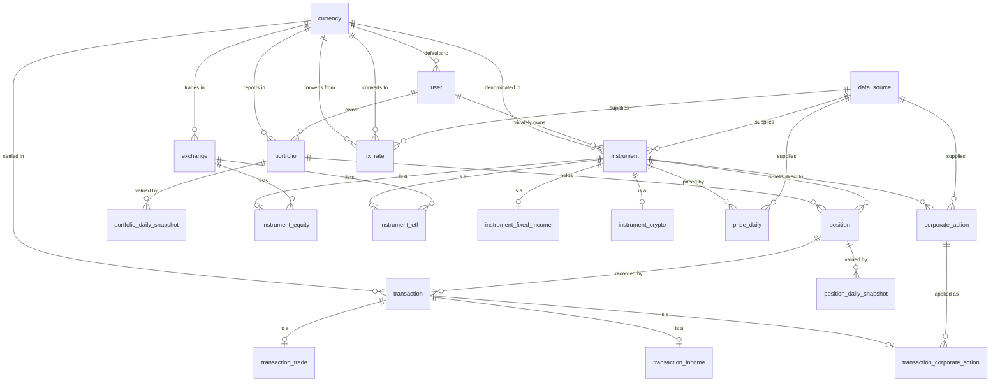

# ValueTracker — Architecture

## Database Model

This document defines the entity-relationship model for ValueTracker, a personal
portfolio management system. It is the agreed blueprint from which migrations,
ORM entities and data-ingestion jobs should be implemented.

---

## 1. Purpose & Scope

ValueTracker lets a person track several investment portfolios, each holding
instruments of mixed classes, and see how those holdings gain or lose value over
time.

### In scope

- Multiple portfolios per user, each with its own objective and reporting currency.
- Mixed asset classes within a portfolio: fixed income, stocks, ETFs, cryptocurrency.
- Class-specific attributes (a fixed-income paper has a rate and a maturity date;
  a stock has a ticker and an exchange) modelled as first-class structure.
- Holdings entered as **transactions**: purchases, disposals, income events and
  corporate actions.
- Daily closing prices for variable-income instruments, and daily FX rates, so
  gains and losses can be computed and charted over any date range.
- Multi-currency holdings reported in the portfolio's base currency.

### Explicitly deferred

Not modelled in v1, discussed in [§11 Deferred Extensions](#11-deferred-extensions):
cash accounts and external contributions/withdrawals, FIFO tax lots, benchmark
comparison, target asset allocation, and intraday prices.

### Notation

The model is **engine-agnostic**. Attribute types are conceptual — `uuid`,
`string`, `decimal`, `date`, `timestamp`, `int`, `boolean` — and map to whatever
the chosen engine offers. Two constraints are non-negotiable regardless of engine:

- **Monetary and quantity values use exact decimal types, never binary floating
  point.** Suggested precision: `decimal(24,8)` for quantities (crypto needs the
  scale), `decimal(20,6)` for prices and amounts, `decimal(20,10)` for FX rates.
- **Every date that identifies a market observation is a calendar date, not a
  timestamp** — a daily close belongs to a trading day, not to an instant.

---

## 2. Design Decisions

| # | Decision | Choice | Rationale | Rejected alternative |
|---|---|---|---|---|
| 1 | Class-specific attributes | **Class-table inheritance** | A base `instrument` table holds what every instrument shares; one 1:1 specialization table per class holds what only that class has. Attributes stay typed and constraint-enforceable — nothing stops the database from requiring a maturity date on a fixed-income row while forbidding it on a stock. | Single table with a JSONB blob, or one wide table of mostly-NULL columns. Both push all validation into application code. |
| 2 | Price granularity | **Daily close** | ~252 rows per instrument per year is negligible volume, and weekly/monthly series are derived by downsampling. The reverse — reconstructing daily detail from weekly rows — is impossible, so daily keeps every future option open at almost no cost. | Weekly-only, which permanently discards intra-week detail. |
| 3 | Currency | **Multi-currency with FX rates** | Instruments and transactions carry their own currency; each portfolio declares a base currency for reporting; `fx_rate` supplies historical conversion. | Single-currency. Retrofitting currency into a live schema means touching every monetary column and backfilling every historical rate. |
| 4 | Event scope | **Trades, income events, corporate actions** | These are the three event families that change either quantity or realised return. | Cash accounts and transfers — deferred (see [§11](#11-deferred-extensions)). |
| 5 | Security identity | **Shared instrument catalog, separate from holdings** | `instrument` is the security; `position` is a portfolio's holding of it. PETR4's price history is stored once and read by every user, giving market-data ingestion a single row to write. | An asset owned by each portfolio, which duplicates identical price history per portfolio and per user. |
| 6 | Cost basis | **Weighted average** | Matches how Brazilian brokers report and what most investors expect. Basis is derived from the transaction ledger; no lot tracking required. | FIFO tax lots — correct for US-style tax reporting, but adds `tax_lot` and lot-consumption tables that v1 does not need. |
| 7 | Valuation for charts | **Daily snapshot tables** | A multi-year chart becomes one indexed range scan instead of replaying the whole ledger against price history on every request. | Deriving on the fly, which degrades sharply as history grows. |
| 8 | Database engine | **Undecided — model stays engine-agnostic** | The model is expressed conceptually so the engine choice stays open. | Committing to vendor DDL before the runtime stack is chosen. |

---

## 3. Model Shape

The model separates into three layers, and the separation is load-bearing.

**Reference & market data — shared, system-owned.**
`currency`, `exchange`, `data_source`, `instrument` and its specializations,
`price_daily`, `fx_rate`, `corporate_action`. Written by ingestion jobs, read by
every user.

**Ownership & ledger — user-owned, the source of truth.**
`user`, `portfolio`, `position`, `transaction` and its specializations. Every
number the system reports must be reproducible from this ledger plus market data.

**Derived — cache, always rebuildable.**
`position_daily_snapshot`, `portfolio_daily_snapshot`, and the cached
`quantity` / `average_cost` / `cost_basis` columns on `position`. Nothing here is
authoritative. A rebuild job regenerates all of it from the two layers above.

### Two structural points worth stating explicitly

**Private instruments.** A CDB issued by one bank and bought by one user is not a
public security, but it still needs the instrument shape: a type, a currency,
class-specific attributes, possibly a price series. This is handled with a
nullable `instrument.owner_user_id` — `NULL` means the shared public catalog,
non-null means an instrument private to that user. Fixed income therefore reuses
the same structure as listed securities instead of needing a parallel one.

**Corporate actions are modelled at two levels, deliberately.**
`corporate_action` hangs off `instrument` and records the *market fact*: a 1:4
split on this date, affecting everyone who holds the security.
`transaction_corporate_action` hangs off `position` and records the *application*
of that fact to one holding: this portfolio's 100 shares became 400, average cost
divided by four, total basis unchanged. Without the instrument-level event, an
ingestion feed has nowhere to write. Without the position-level row, quantity and
cost basis silently break the first time an instrument splits.

---

## 4. Conceptual Overview

The core entities and how they relate, without attributes.



The two `_specialization` boxes are placeholders standing in for the concrete
subtype tables, expanded in [§5.2](#52-instrument-catalog) and
[§5.3](#53-transaction-ledger).

---

## 5. Detailed Diagrams by Subject Area

### 5.1 Identity & Portfolios



A portfolio's `base_currency_code` is fixed at creation. Changing it would
invalidate every stored snapshot, so a change is modelled as creating a new
portfolio, not as an update.

### 5.2 Instrument Catalog



`instrument_type` is the discriminator: exactly one specialization row must exist
for an instrument, and it must be the one its type names. `is_variable_income`
is a derived convenience flag — true for equity, ETF and crypto — that lets
valuation jobs select mark-to-market instruments without joining subtype tables.

Adding a new asset class (a fund, a REIT, real estate) means adding one
specialization table and one discriminator value. No existing table changes.

### 5.3 Transaction Ledger



The second `instrument → corporate_action` edge is the `resulting_instrument_id`
reference — the security a holding converts into after a merger or ticker change.

The `transaction` base carries what every event shares: which position, when, in
what currency, at what FX rate. The subtype carries what only that event family
has. The transaction currency is stored per row rather than inherited from the
instrument, because fees and taxes are occasionally charged in a different
currency from the security itself.

Note the `fx_rate_to_base` snapshot on the transaction. The rate is captured at
trade date and frozen. Recomputing a historical purchase with today's rate would
silently change the past.

### 5.4 Market Data & Valuation



`price_daily` keeps both `close_price` (as traded on the day) and
`adjusted_close` (back-adjusted for splits and dividends). Charts of *price*
should use the adjusted series so a split does not appear as a crash; valuation
of a *holding* must use the raw close against the quantity actually held on that
date, because the corporate-action transaction has already adjusted the quantity.
Using the adjusted series for valuation double-counts the split.

`fx_rate` is directional. Store one direction consistently — the convention here
is `rate` = units of `quote_currency_code` per one unit of `base_currency_code` —
and invert when the reverse is needed, rather than storing both directions and
risking them disagreeing.

---

## 6. Complete ER Diagram

All entities and relationships, without attributes.



---

## 7. Entity Dictionary

Legend — **PK** primary key, **FK** foreign key, **UK** unique key.
Nullability column: `N` = required, `Y` = optional.

### 7.1 `currency`

ISO 4217 reference table. Seeded, not user-editable.

| Attribute | Type | Null | Description |
|---|---|---|---|
| `code` | char(3) **PK** | N | ISO 4217 code, e.g. `BRL`, `USD` |
| `name` | string(64) | N | Display name |
| `symbol` | string(8) | Y | e.g. `R$` |
| `minor_unit` | int | N | Decimal places, normally 2 |

### 7.2 `exchange`

| Attribute | Type | Null | Description |
|---|---|---|---|
| `code` | string(16) **PK** | N | e.g. `B3`, `NASDAQ` |
| `name` | string(128) | N | |
| `country_code` | char(2) | N | ISO 3166-1 |
| `currency_code` | char(3) **FK** → `currency` | N | Trading currency |
| `timezone` | string(64) | N | IANA name, defines the trading day boundary |

### 7.3 `data_source`

Provenance for every externally ingested fact.

| Attribute | Type | Null | Description |
|---|---|---|---|
| `id` | uuid **PK** | N | |
| `name` | string(64) **UK** | N | e.g. `B3_EOD`, `COINGECKO` |
| `description` | string(255) | Y | |
| `priority` | int | N | Lower value wins when two sources disagree |
| `is_active` | boolean | N | |

### 7.4 `user`

| Attribute | Type | Null | Description |
|---|---|---|---|
| `id` | uuid **PK** | N | |
| `email` | string(255) **UK** | N | Login identity |
| `display_name` | string(128) | N | |
| `base_currency_code` | char(3) **FK** → `currency` | N | Default for new portfolios |
| `timezone` | string(64) | N | |
| `created_at` | timestamp | N | |
| `updated_at` | timestamp | N | |

Authentication credentials are intentionally out of this model — they belong to
the identity/auth concern, not the portfolio domain.

### 7.5 `portfolio`

| Attribute | Type | Null | Description |
|---|---|---|---|
| `id` | uuid **PK** | N | |
| `user_id` | uuid **FK** → `user` | N | Owner |
| `name` | string(128) | N | e.g. "Faculdade da Ana" |
| `description` | string(512) | Y | |
| `objective` | string(32) | Y | `RETIREMENT`, `EDUCATION`, `EMERGENCY`, `GENERAL` |
| `base_currency_code` | char(3) **FK** → `currency` | N | Reporting currency, immutable after creation |
| `target_date` | date | Y | Goal horizon |
| `created_at` | timestamp | N | |
| `archived_at` | timestamp | Y | Null while active; archive rather than delete |

Constraints: **UK** (`user_id`, `name`).

### 7.6 `instrument`

The security. Public rows are shared by all users; private rows belong to one.

| Attribute | Type | Null | Description |
|---|---|---|---|
| `id` | uuid **PK** | N | |
| `instrument_type` | string(24) | N | Discriminator: `EQUITY`, `ETF`, `FIXED_INCOME`, `CRYPTO` |
| `owner_user_id` | uuid **FK** → `user` | Y | Null = public catalog; non-null = private to that user |
| `name` | string(255) | N | |
| `currency_code` | char(3) **FK** → `currency` | N | Denomination |
| `data_source_id` | uuid **FK** → `data_source` | Y | Null when maintained by hand |
| `status` | string(16) | N | `ACTIVE`, `DELISTED`, `MATURED`, `SUSPENDED` |
| `is_variable_income` | boolean | N | True for equity/ETF/crypto; drives mark-to-market |
| `created_at` | timestamp | N | |
| `updated_at` | timestamp | N | |

Constraints: exactly one specialization row must exist, matching
`instrument_type`. A public instrument's natural key (ticker + exchange, or
crypto symbol + network) must be unique across public rows.

### 7.7 `instrument_equity`

| Attribute | Type | Null | Description |
|---|---|---|---|
| `instrument_id` | uuid **PK / FK** → `instrument` | N | |
| `ticker` | string(16) | N | e.g. `PETR4` |
| `exchange_code` | string(16) **FK** → `exchange` | N | |
| `isin` | char(12) | Y | |
| `sector` | string(64) | Y | |
| `country_code` | char(2) | Y | Issuer domicile |

Constraints: **UK** (`exchange_code`, `ticker`) for public instruments.

### 7.8 `instrument_etf`

| Attribute | Type | Null | Description |
|---|---|---|---|
| `instrument_id` | uuid **PK / FK** → `instrument` | N | |
| `ticker` | string(16) | N | e.g. `BOVA11`, `IVVB11` |
| `exchange_code` | string(16) **FK** → `exchange` | N | |
| `isin` | char(12) | Y | |
| `benchmark_index` | string(64) | Y | e.g. `IBOVESPA`, `SP500` |
| `expense_ratio` | decimal(6,4) | Y | Annual, as a fraction |
| `replication_method` | string(16) | Y | `PHYSICAL`, `SYNTHETIC` |

Kept separate from `instrument_equity` because an ETF's economics are described
by its benchmark and expense ratio, not by a sector and an issuer domicile.

### 7.9 `instrument_fixed_income`

| Attribute | Type | Null | Description |
|---|---|---|---|
| `instrument_id` | uuid **PK / FK** → `instrument` | N | |
| `issuer_name` | string(255) | N | Bank or government |
| `issuer_tax_id` | string(32) | Y | CNPJ or equivalent |
| `indexation_type` | string(16) | N | `PRE`, `CDI`, `IPCA`, `SELIC` |
| `contracted_rate` | decimal(10,6) | Y | Annual rate — the fixed part, or the spread over an index |
| `index_percentage` | decimal(10,4) | Y | e.g. `110` for 110% of CDI |
| `issue_date` | date | N | |
| `maturity_date` | date | N | |
| `coupon_frequency` | string(16) | N | `NONE`, `MONTHLY`, `SEMIANNUAL`, `ANNUAL` |
| `day_count_convention` | string(16) | N | e.g. `BUS252`, `ACT360` |
| `face_value` | decimal(20,6) | Y | Nominal at maturity |
| `allows_early_redemption` | boolean | N | Daily liquidity or not |
| `tax_regime` | string(24) | Y | e.g. `REGRESSIVE_IR`, `EXEMPT` |

`indexation_type` combined with `contracted_rate` and `index_percentage` covers
the three common shapes: pre-fixed (`PRE` + rate), a percentage of an index
(`CDI` + 110%), and an index plus a spread (`IPCA` + 5.5%).

### 7.10 `instrument_crypto`

| Attribute | Type | Null | Description |
|---|---|---|---|
| `instrument_id` | uuid **PK / FK** → `instrument` | N | |
| `symbol` | string(16) | N | e.g. `BTC`, `ETH` |
| `network` | string(32) | Y | e.g. `BITCOIN`, `ETHEREUM` |
| `contract_address` | string(128) | Y | For tokens |
| `decimals` | int | N | Divisibility, e.g. 8 for BTC |

Constraints: **UK** (`symbol`, `network`) for public instruments.

### 7.11 `position`

A portfolio's holding of one instrument. Created on the first transaction and
kept even after it is fully sold, so history survives.

| Attribute | Type | Null | Description |
|---|---|---|---|
| `id` | uuid **PK** | N | |
| `portfolio_id` | uuid **FK** → `portfolio` | N | |
| `instrument_id` | uuid **FK** → `instrument` | N | |
| `quantity` | decimal(24,8) | N | *Derived cache* — current units held |
| `average_cost` | decimal(20,6) | N | *Derived cache* — weighted average unit cost |
| `cost_basis` | decimal(20,6) | N | *Derived cache* — `quantity` × `average_cost` |
| `realized_pnl` | decimal(20,6) | N | *Derived cache* — cumulative, in instrument currency |
| `opened_at` | date | N | Date of the first transaction |
| `closed_at` | date | Y | Set when quantity reaches zero; cleared if rebought |
| `updated_at` | timestamp | N | |

Constraints: **UK** (`portfolio_id`, `instrument_id`) — one position per
instrument per portfolio. `quantity` must never be negative in v1 (no shorts).

The four cached columns exist only so a portfolio list renders without replaying
the ledger. They are recomputable from `transaction` at any time, and a
consistency job should verify them.

### 7.12 `transaction`

The base event. Every change to a position goes through here.

| Attribute | Type | Null | Description |
|---|---|---|---|
| `id` | uuid **PK** | N | |
| `position_id` | uuid **FK** → `position` | N | |
| `transaction_type` | string(24) | N | Discriminator: `TRADE`, `INCOME`, `CORPORATE_ACTION` |
| `trade_date` | date | N | When the event occurred — drives ordering and FX |
| `settlement_date` | date | Y | When cash moved |
| `currency_code` | char(3) **FK** → `currency` | N | Currency of this event's amounts |
| `fx_rate_to_base` | decimal(20,10) | N | Rate to the portfolio's base currency at `trade_date`; `1` when already base |
| `total_amount` | decimal(20,6) | N | Signed net amount in `currency_code` |
| `notes` | string(512) | Y | |
| `external_ref` | string(128) | Y | Broker note number or import idempotency key |
| `created_at` | timestamp | N | |

Constraints: exactly one specialization row, matching `transaction_type`.
**UK** (`position_id`, `external_ref`) where `external_ref` is present, so
re-importing a broker file cannot duplicate events.

### 7.13 `transaction_trade`

| Attribute | Type | Null | Description |
|---|---|---|---|
| `transaction_id` | uuid **PK / FK** → `transaction` | N | |
| `side` | string(8) | N | `BUY`, `SELL` |
| `quantity` | decimal(24,8) | N | Always positive; `side` carries the direction |
| `unit_price` | decimal(20,6) | N | |
| `gross_amount` | decimal(20,6) | N | `quantity` × `unit_price` |
| `fees` | decimal(20,6) | N | Brokerage, exchange, custody; default 0 |
| `taxes` | decimal(20,6) | N | Transaction taxes; default 0 |
| `net_amount` | decimal(20,6) | N | Buy: gross + fees + taxes. Sell: gross − fees − taxes |

### 7.14 `transaction_income`

Dividends, JCP, coupons, interest payments, amortizations.

| Attribute | Type | Null | Description |
|---|---|---|---|
| `transaction_id` | uuid **PK / FK** → `transaction` | N | |
| `income_type` | string(24) | N | `DIVIDEND`, `JCP`, `INTEREST`, `COUPON`, `AMORTIZATION`, `RENT` |
| `ex_date` | date | Y | Entitlement date |
| `payment_date` | date | N | |
| `quantity_basis` | decimal(24,8) | N | Units held at `ex_date` |
| `amount_per_unit` | decimal(20,8) | Y | |
| `gross_amount` | decimal(20,6) | N | |
| `withholding_tax` | decimal(20,6) | N | Default 0 |
| `net_amount` | decimal(20,6) | N | `gross_amount` − `withholding_tax` |

Income never changes `quantity` or `average_cost`. It accumulates into realised
return, which is why yield can be reported separately from price appreciation.
`AMORTIZATION` is the exception worth flagging: a principal repayment reduces
cost basis rather than counting as income, and must be handled as such.

### 7.15 `transaction_corporate_action`

The application of a market event to one holding.

| Attribute | Type | Null | Description |
|---|---|---|---|
| `transaction_id` | uuid **PK / FK** → `transaction` | N | |
| `corporate_action_id` | uuid **FK** → `corporate_action` | N | The market event applied |
| `quantity_before` | decimal(24,8) | N | |
| `quantity_after` | decimal(24,8) | N | |
| `average_cost_before` | decimal(20,6) | N | |
| `average_cost_after` | decimal(20,6) | N | |
| `cash_in_lieu` | decimal(20,6) | Y | Payment for fractional remainders |

Constraints: **UK** (`position_id` via `transaction`, `corporate_action_id`) — a
given action applies to a given position at most once. Storing before *and* after
values makes the adjustment auditable rather than requiring a replay to explain
why a quantity changed.

### 7.16 `corporate_action`

The market fact, independent of who holds the security.

| Attribute | Type | Null | Description |
|---|---|---|---|
| `id` | uuid **PK** | N | |
| `instrument_id` | uuid **FK** → `instrument` | N | Affected security |
| `action_type` | string(24) | N | `SPLIT`, `REVERSE_SPLIT`, `BONUS`, `MERGER`, `TICKER_CHANGE`, `SPINOFF` |
| `announcement_date` | date | Y | |
| `ex_date` | date | N | |
| `effective_date` | date | N | |
| `ratio_numerator` | decimal(20,8) | Y | New units per `ratio_denominator` old units |
| `ratio_denominator` | decimal(20,8) | Y | |
| `amount_per_unit` | decimal(20,8) | Y | For cash components |
| `resulting_instrument_id` | uuid **FK** → `instrument` | Y | Target security for mergers and ticker changes |
| `data_source_id` | uuid **FK** → `data_source` | Y | |

Constraints: **UK** (`instrument_id`, `action_type`, `ex_date`).

### 7.17 `price_daily`

One closing observation per instrument per trading day.

| Attribute | Type | Null | Description |
|---|---|---|---|
| `instrument_id` | uuid **PK / FK** → `instrument` | N | |
| `price_date` | date **PK** | N | Trading day |
| `open_price` | decimal(20,6) | Y | |
| `high_price` | decimal(20,6) | Y | |
| `low_price` | decimal(20,6) | Y | |
| `close_price` | decimal(20,6) | N | The one required value |
| `adjusted_close` | decimal(20,6) | Y | Back-adjusted for splits and dividends |
| `volume` | decimal(24,8) | Y | |
| `data_source_id` | uuid **FK** → `data_source` | N | |
| `ingested_at` | timestamp | N | |

Constraints: **PK** (`instrument_id`, `price_date`). Non-trading days simply have
no row — absence means "market closed", and valuation carries the last available
close forward.

### 7.18 `fx_rate`

| Attribute | Type | Null | Description |
|---|---|---|---|
| `base_currency_code` | char(3) **PK / FK** → `currency` | N | |
| `quote_currency_code` | char(3) **PK / FK** → `currency` | N | |
| `rate_date` | date **PK** | N | |
| `rate` | decimal(20,10) | N | Units of quote per one unit of base |
| `data_source_id` | uuid **FK** → `data_source` | N | |

Constraints: **PK** (`base_currency_code`, `quote_currency_code`, `rate_date`);
`base_currency_code` ≠ `quote_currency_code`.

### 7.19 `position_daily_snapshot`

Derived. Rebuildable from `transaction` + `price_daily` + `fx_rate`.

| Attribute | Type | Null | Description |
|---|---|---|---|
| `position_id` | uuid **PK / FK** → `position` | N | |
| `snapshot_date` | date **PK** | N | |
| `quantity` | decimal(24,8) | N | Units held on that date |
| `close_price` | decimal(20,6) | N | In instrument currency; carried forward on non-trading days |
| `market_value_local` | decimal(20,6) | N | `quantity` × `close_price` |
| `market_value_base` | decimal(20,6) | N | Converted at that date's FX rate |
| `average_cost` | decimal(20,6) | N | As of that date |
| `cost_basis_base` | decimal(20,6) | N | |
| `unrealized_pnl_base` | decimal(20,6) | N | `market_value_base` − `cost_basis_base` |
| `computed_at` | timestamp | N | |

### 7.20 `portfolio_daily_snapshot`

Derived. The aggregate of that day's position snapshots, and the primary read
path for portfolio charts.

| Attribute | Type | Null | Description |
|---|---|---|---|
| `portfolio_id` | uuid **PK / FK** → `portfolio` | N | |
| `snapshot_date` | date **PK** | N | |
| `market_value_base` | decimal(20,6) | N | |
| `cost_basis_base` | decimal(20,6) | N | |
| `unrealized_pnl_base` | decimal(20,6) | N | |
| `realized_pnl_cumulative_base` | decimal(20,6) | N | |
| `income_cumulative_base` | decimal(20,6) | N | Dividends, coupons and interest to date |
| `daily_return_pct` | decimal(12,8) | Y | Day-over-day return, net of the day's flows |
| `computed_at` | timestamp | N | |

---

## 8. Business Rules & Invariants

These are the rules the implementation must honour. They are stated here rather
than left implicit in code because several of them are quietly easy to get wrong.

### 8.1 Weighted-average cost basis

**On BUY:**

```
new_cost_basis  = cost_basis + (quantity × unit_price) + fees + taxes
new_quantity    = quantity + bought_quantity
new_average_cost = new_cost_basis / new_quantity
```

Acquisition costs are capitalised into the basis, not expensed.

**On SELL:**

```
proceeds       = (quantity × unit_price) − fees − taxes
realized_pnl  += proceeds − (average_cost × sold_quantity)
cost_basis    -= average_cost × sold_quantity
quantity      -= sold_quantity
average_cost   = unchanged
```

A sale never moves the average cost. It removes basis proportionally and books
the difference as realised P&L. When `quantity` reaches zero, set `closed_at`;
if the instrument is later rebought, clear `closed_at` and start the average
afresh from the new purchase.

### 8.2 Corporate actions preserve total cost basis

For a split of ratio `numerator : denominator` (each `denominator` old units
become `numerator` new units), with `factor = numerator / denominator`:

```
quantity_after     = quantity_before × factor
average_cost_after = average_cost_before / factor
cost_basis         = unchanged
```

The invariant is that `cost_basis` is identical before and after. A reverse split
is the same formula with `factor < 1`. Fractional remainders that cannot be held
are settled through `cash_in_lieu` and reduce basis accordingly.

### 8.3 Currency conversion is always historical

Every monetary amount carries its own `currency_code`. Conversion to the
portfolio's base currency uses the rate **at the date of the event**, captured in
`transaction.fx_rate_to_base` at write time. Never convert a historical amount
using today's rate — doing so makes past values drift with the exchange rate.

For valuation, a given day's `market_value_base` uses that day's `fx_rate`, so
the chart correctly reflects both price movement and currency movement.

### 8.4 Fixed income is accrued, not marked to market

Variable-income instruments (`is_variable_income = true`) are valued from
`price_daily`. Fixed income has no meaningful daily close in the same sense; its
value on a given date is computed by accrual from `issue_date` using
`indexation_type`, `contracted_rate` / `index_percentage` and
`day_count_convention`, against the relevant index series.

`price_daily` rows are therefore *optional* for fixed income — useful when a paper
genuinely is marked to market (secondary-market government bonds), absent
otherwise. Valuation logic branches on `is_variable_income`, not on the presence
of price rows.

### 8.5 Snapshots are derived and idempotent

No snapshot value may be the only place a fact lives. The nightly valuation job
must be safely re-runnable for any date range and must produce identical results
on re-execution given the same ledger and market data. A late-arriving price
correction or a backdated transaction triggers a recompute from that date
forward.

The same holds for the cached columns on `position`: authoritative state is the
ledger, and a periodic reconciliation should confirm the cache agrees with it.

### 8.6 Structural invariants

- One `position` per (`portfolio`, `instrument`).
- `position.quantity ≥ 0` — no short positions in v1.
- Exactly one specialization row per `instrument`, matching `instrument_type`.
- Exactly one specialization row per `transaction`, matching `transaction_type`.
- A `position` may only reference an instrument that is public
  (`owner_user_id IS NULL`) or private to the same user who owns the portfolio.
- `transaction.trade_date` must fall on or after `position.opened_at`, and for a
  fixed-income instrument, on or before `maturity_date`.
- A portfolio is archived, never hard-deleted, while any transaction references it.

---

## 9. Worked Examples

Three scenarios traced through the model, confirming each is expressible without
inventing structure.

### 9.1 Two purchases of a stock

Buy 100 PETR4 at R$38.50 with R$4.90 in fees, then 50 more at R$41.00 with
R$4.90 in fees. Portfolio base currency BRL.

| Step | Rows written | Resulting position state |
|---|---|---|
| First buy | `position` (created), `transaction` (`TRADE`, BRL, fx 1.0), `transaction_trade` (`BUY`, qty 100, price 38.50, fees 4.90, net 3854.90) | qty 100, basis 3854.90, avg cost **38.5490** |
| Second buy | `transaction` + `transaction_trade` (`BUY`, qty 50, price 41.00, fees 4.90, net 2054.90) | qty 150, basis 5909.80, avg cost **39.398667** |

### 9.2 A dividend, then a split

Continuing from above: a R$0.75/unit dividend on 150 units, then a 1:4 split
(each 1 share becomes 4).

| Step | Rows written | Resulting position state |
|---|---|---|
| Dividend | `transaction` (`INCOME`), `transaction_income` (`DIVIDEND`, basis 150, per-unit 0.75, gross 112.50) | qty 150, basis 5909.80, avg cost 39.398667 — **unchanged**; 112.50 accrues to income |
| 1:4 split | `corporate_action` (`SPLIT`, ratio 4:1) at instrument level; `transaction` (`CORPORATE_ACTION`) + `transaction_corporate_action` at position level | qty **600**, avg cost **9.849667**, basis **5909.80** — unchanged, as required by §8.2 |

### 9.3 A foreign-currency crypto holding

Buy 0.15 BTC at USD 62,000 with USD 30 in fees, inside a BRL-base portfolio, on
a day when USD/BRL = 5.42.

- `instrument` (`CRYPTO`, currency `USD`) + `instrument_crypto` (`BTC`, network `BITCOIN`, decimals 8).
- `transaction` with `currency_code = USD` and `fx_rate_to_base = 5.42`, frozen at trade date.
- `transaction_trade`: qty 0.15, price 62000, fees 30, net **USD 9,330.00**.
- Position basis is USD 9,330.00; in base currency, **BRL 50,568.60**.
- Each day thereafter, `position_daily_snapshot` records `market_value_local`
  from `price_daily` in USD, and `market_value_base` using that day's `fx_rate` —
  so the BRL chart moves with both the BTC price and the exchange rate, which is
  the economically correct result.

---

## 10. Volumetrics & Indexing

Row counts are small enough that no exotic strategy is needed at launch, but two
tables grow linearly with time and deserve attention.

| Table | Growth driver | Order of magnitude |
|---|---|---|
| `price_daily` | instruments × trading days | ~252 rows/instrument/year → 5,000 instruments over 10 years ≈ **12.6M rows** |
| `fx_rate` | currency pairs × days | ~365 rows/pair/year → negligible |
| `position_daily_snapshot` | positions × days | 10,000 positions × 365 ≈ **3.65M rows/year** |
| `portfolio_daily_snapshot` | portfolios × days | ~365 rows/portfolio/year → negligible |
| `transaction` | user activity | Hundreds per portfolio per year |

### Access paths that matter

| Query | Supporting index |
|---|---|
| Chart an instrument over a date range | `(instrument_id, price_date)` — the PK, already ordered correctly for a range scan |
| Chart a portfolio over a date range | `(portfolio_id, snapshot_date)` — the PK |
| Latest close for a set of instruments | `(instrument_id, price_date DESC)` |
| A portfolio's current holdings | `(portfolio_id)` on `position`, with `closed_at IS NULL` |
| A position's ledger in order | `(position_id, trade_date)` on `transaction` |
| Convert on a date | `(base_currency_code, quote_currency_code, rate_date)` — the PK |
| Re-import idempotency | `(position_id, external_ref)` |

Composite primary keys on the two time-series tables are deliberately ordered
`(entity, date)` so that the most common query — one entity across a date range —
is a single contiguous scan.

`price_daily` and `position_daily_snapshot` are the candidates for range
partitioning by date if and when they outgrow single-table handling. Nothing in
the model needs to change to adopt it later.

---

## 11. Deferred Extensions

Deliberately excluded from v1, with the consequence of each exclusion noted.

**Cash accounts and external contributions.** There is no cash entity, so the
model cannot distinguish "the portfolio grew because it gained value" from "the
portfolio grew because more money went in". Buys and sells serve as a proxy for
flows, which makes time-weighted return approximate and true money-weighted
return (IRR) unavailable. Adding a `cash_account` and a `cash_movement` entity,
plus deposit/withdrawal transaction types, closes this gap — worth doing before
any return-vs-benchmark reporting is promised.

**FIFO tax lots.** Weighted average covers reporting for the target market. A
`tax_lot` table plus lot-consumption rows on sales would be needed for
jurisdictions requiring specific-lot or FIFO accounting. The transaction ledger
already carries enough information to reconstruct lots retroactively.

**Benchmarks.** Comparing a portfolio against IBOVESPA or CDI needs a benchmark
series and a portfolio-to-benchmark association. The `instrument` +
`price_daily` structures can host an index series directly; only the association
is missing.

**Target allocation.** Tracking a desired split across asset classes and flagging
drift needs an `asset_class` lookup and a `portfolio_allocation_target` table.

**Intraday prices.** Only warranted if live intraday charts become a requirement;
it multiplies market-data volume by orders of magnitude.

**Materialized weekly/monthly rollups.** Multi-year charts currently downsample
from `price_daily` and the snapshot tables at query time. If that becomes slow,
pre-aggregated rollup tables are the next step — the daily source of truth makes
them safe to add at any point.
