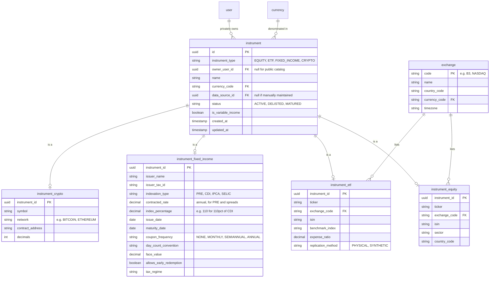

# Spec: `catalog`

Module `catalog` from [`CAPABILITY-MAP.md`](./CAPABILITY-MAP.md). Depends on:
`identity`. Project-wide stack, commands, structure, style, testing and
boundaries are defined once in [`SPEC.md`](./SPEC.md).

---

## Objective

Own the definition of *what can be held* — the securities and the reference data
they are denominated in — so that `portfolio` and `ledger` can reference an
instrument without knowing anything about its asset class.

This is where `ARCHITECTURE.md`'s class-table inheritance becomes code. It is the
module that determines whether adding a fifth asset class later is a one-table
change or a refactor.

**Not in scope:** prices (that is `market-data`), holdings (that is `ledger`),
corporate actions (defined by `market-data`, applied by `ledger`).

---

## Data Model

`catalog` owns the securities themselves and the reference data they are
denominated in. These definitions moved out of `ARCHITECTURE.md`, which now
carries only the system-wide view, to sit with the module that owns them.



`instrument_type` is the discriminator: exactly one specialization row must exist
for an instrument, and it must be the one its type names. `is_variable_income`
is a derived convenience flag — true for equity, ETF and crypto — that lets
valuation jobs select mark-to-market instruments without joining subtype tables.

Adding a new asset class (a fund, a REIT, real estate) means adding one
specialization table and one discriminator value. No existing table changes.

### Entity dictionary

Legend — **PK** primary key, **FK** foreign key, **UK** unique key.
Nullability: `N` = required, `Y` = optional.

### `currency`

ISO 4217 reference table. Seeded, not user-editable.

| Attribute | Type | Null | Description |
|---|---|---|---|
| `code` | char(3) **PK** | N | ISO 4217 code, e.g. `BRL`, `USD` |
| `name` | string(64) | N | Display name |
| `symbol` | string(8) | Y | e.g. `R$` |
| `minor_unit` | int | N | Decimal places, normally 2 |

### `exchange`

| Attribute | Type | Null | Description |
|---|---|---|---|
| `code` | string(16) **PK** | N | e.g. `B3`, `NASDAQ` |
| `name` | string(128) | N | |
| `country_code` | char(2) | N | ISO 3166-1 |
| `currency_code` | char(3) **FK** → `currency` | N | Trading currency |
| `timezone` | string(64) | N | IANA name, defines the trading day boundary |

### `data_source`

Provenance for every externally ingested fact.

| Attribute | Type | Null | Description |
|---|---|---|---|
| `id` | uuid **PK** | N | |
| `name` | string(64) **UK** | N | e.g. `B3_EOD`, `COINGECKO` |
| `description` | string(255) | Y | |
| `priority` | int | N | Lower value wins when two sources disagree |
| `is_active` | boolean | N | |

### `instrument`

The security. Public rows are shared by all users; private rows belong to one.

| Attribute | Type | Null | Description |
|---|---|---|---|
| `id` | uuid **PK** | N | |
| `instrument_type` | string(24) | N | Discriminator: `EQUITY`, `ETF`, `FIXED_INCOME`, `CRYPTO` |
| `owner_user_id` | uuid **FK** → `user` | Y | Null = public catalog; non-null = private to that user |
| `name` | string(255) | N | |
| `currency_code` | char(3) **FK** → `currency` | N | Denomination |
| `data_source_id` | uuid **FK** → `data_source` | Y | Null when maintained by hand |
| `status` | string(16) | N | `ACTIVE`, `DELISTED`, `MATURED`, `SUSPENDED` |
| `is_variable_income` | boolean | N | True for equity/ETF/crypto; drives mark-to-market |
| `created_at` | timestamp | N | |
| `updated_at` | timestamp | N | |

Constraints: exactly one specialization row must exist, matching
`instrument_type`. A public instrument's natural key (ticker + exchange, or
crypto symbol + network) must be unique across public rows.

### `instrument_equity`

| Attribute | Type | Null | Description |
|---|---|---|---|
| `instrument_id` | uuid **PK / FK** → `instrument` | N | |
| `ticker` | string(16) | N | e.g. `PETR4` |
| `exchange_code` | string(16) **FK** → `exchange` | N | |
| `isin` | char(12) | Y | |
| `sector` | string(64) | Y | |
| `country_code` | char(2) | Y | Issuer domicile |

Constraints: **UK** (`exchange_code`, `ticker`) for public instruments.

### `instrument_etf`

| Attribute | Type | Null | Description |
|---|---|---|---|
| `instrument_id` | uuid **PK / FK** → `instrument` | N | |
| `ticker` | string(16) | N | e.g. `BOVA11`, `IVVB11` |
| `exchange_code` | string(16) **FK** → `exchange` | N | |
| `isin` | char(12) | Y | |
| `benchmark_index` | string(64) | Y | e.g. `IBOVESPA`, `SP500` |
| `expense_ratio` | decimal(6,4) | Y | Annual, as a fraction |
| `replication_method` | string(16) | Y | `PHYSICAL`, `SYNTHETIC` |

Kept separate from `instrument_equity` because an ETF's economics are described
by its benchmark and expense ratio, not by a sector and an issuer domicile.

### `instrument_fixed_income`

| Attribute | Type | Null | Description |
|---|---|---|---|
| `instrument_id` | uuid **PK / FK** → `instrument` | N | |
| `issuer_name` | string(255) | N | Bank or government |
| `issuer_tax_id` | string(32) | Y | CNPJ or equivalent |
| `indexation_type` | string(16) | N | `PRE`, `CDI`, `IPCA`, `SELIC` |
| `contracted_rate` | decimal(10,6) | Y | Annual rate — the fixed part, or the spread over an index |
| `index_percentage` | decimal(10,4) | Y | e.g. `110` for 110% of CDI |
| `issue_date` | date | N | |
| `maturity_date` | date | N | |
| `coupon_frequency` | string(16) | N | `NONE`, `MONTHLY`, `SEMIANNUAL`, `ANNUAL` |
| `day_count_convention` | string(16) | N | e.g. `BUS252`, `ACT360` |
| `face_value` | decimal(20,6) | Y | Nominal at maturity |
| `allows_early_redemption` | boolean | N | Daily liquidity or not |
| `tax_regime` | string(24) | Y | e.g. `REGRESSIVE_IR`, `EXEMPT` |

`indexation_type` combined with `contracted_rate` and `index_percentage` covers
the three common shapes: pre-fixed (`PRE` + rate), a percentage of an index
(`CDI` + 110%), and an index plus a spread (`IPCA` + 5.5%).

### `instrument_crypto`

| Attribute | Type | Null | Description |
|---|---|---|---|
| `instrument_id` | uuid **PK / FK** → `instrument` | N | |
| `symbol` | string(16) | N | e.g. `BTC`, `ETH` |
| `network` | string(32) | Y | e.g. `BITCOIN`, `ETHEREUM` |
| `contract_address` | string(128) | Y | For tokens |
| `decimals` | int | N | Divisibility, e.g. 8 for BTC |

Constraints: **UK** (`symbol`, `network`) for public instruments.

### Structural invariants owned here

- Exactly one specialization row per `instrument`, matching `instrument_type`.
  Neither zero nor two is a valid record; Prisma cannot express this, see below.
- `is_variable_income` is true for equity, ETF and crypto and false for fixed
  income. It is derived from `instrument_type`, never accepted from a client.
- Public uniqueness — `(exchange_code, ticker)` and `(symbol, network)` — applies
  only to rows with `owner_user_id IS NULL`, so two users may each hold a private
  instrument carrying the same identifiers. This requires a partial unique index.

### The inheritance mapping is the hard part

Prisma has no native joined-table inheritance. The base and each specialization
are separate models joined by a 1:1 relation on `instrument_id`. Two consequences
the implementation must handle explicitly, because the ORM will not:

1. **Prisma cannot enforce "exactly one specialization row, matching
   `instrument_type`."** That invariant (see "Structural invariants owned here" above) must be enforced
   by a database `CHECK` constraint or trigger added in a hand-written migration,
   *and* by always creating base + specialization inside one transaction. An
   instrument with no specialization row, or with two, is a corrupt record.
2. **Reads need a discriminated union at the service boundary.** The public type
   is a TypeScript discriminated union on `instrumentType`, so callers get
   exhaustiveness checking. Leaking four optional relations to callers pushes the
   `undefined`-handling into every consumer and defeats the point of the model.

---

## API Surface

| Method | Path | Purpose | Auth |
|---|---|---|---|
| `GET` | `/currencies` | List supported currencies | Yes |
| `GET` | `/exchanges` | List exchanges | Yes |
| `GET` | `/instruments` | Search the catalog; filter by type, ticker, name | Yes |
| `GET` | `/instruments/:id` | One instrument with its specialization | Yes |
| `POST` | `/instruments` | Create a **private** instrument (fixed income) | Yes |
| `PATCH` | `/instruments/:id` | Update a private instrument the user owns | Yes |

`GET` returns public instruments (`owner_user_id IS NULL`) **union** the calling
user's private ones. `POST` may only create private instruments — the public
catalog is written by `market-data` ingestion and by seeds, never by an API
client.

---

## Acceptance Criteria

- [ ] All four specializations exist as separate tables with a 1:1 relation to `instrument`, per `ARCHITECTURE.md` §7.
- [ ] Creating an instrument writes base + specialization **atomically**; a failure in either leaves no partial row. Proven by an integration test that forces the second insert to fail.
- [ ] A database-level constraint rejects an `instrument` whose specialization does not match its `instrument_type`. Proven by raw SQL in an integration test, bypassing the service layer.
- [ ] `GET /instruments/:id` returns a discriminated union; adding a fifth `instrument_type` produces a **compile error** at every exhaustive switch until handled.
- [ ] A user cannot read, update or discover another user's private instrument — 404, not 403, so private instruments are not enumerable.
- [ ] `POST /instruments` rejects an attempt to create a public instrument (`owner_user_id = null`).
- [ ] Public uniqueness holds: `(exchange_code, ticker)` for equity/ETF and `(symbol, network)` for crypto are unique **among public instruments only** — two users may each hold a private CDB with the same name. Requires a partial unique index.
- [ ] `instrument.currency_code` and `exchange.currency_code` are FK-validated against `currency`.
- [ ] `is_variable_income` is true for equity/ETF/crypto and false for fixed income, enforced rather than trusted.
- [ ] Seeds load BRL/USD/EUR, the B3 exchange, and at least one data source.
- [ ] Adding a new asset class requires **one new table and one discriminator value** — no changes to existing tables. Demonstrated in the ADR, not merely claimed.

## Verification

```
npx prisma migrate reset && npx prisma db seed
npm test -- --selectProjects integration -- catalog     # constraints, atomicity, partial indexes
npm run test:e2e -- catalog                             # private-instrument isolation
```

Manual: create a private CDB as user A, confirm user B's `GET /instruments`
does not list it and `GET /instruments/:id` returns 404.

## Open Questions

- Does the fixed-income `indexation_type` need to be a lookup table rather than a
  string enum, so `valuation` can join it to an index series? Likely yes — revisit
  when `market-data` is specified.
- Should ETFs reuse `instrument_equity` after all? They are modelled separately above; if the distinct fields go unused in practice, that is a
  simplification worth taking before the table has data.
- Ticker changes over time (`corporate_action` `TICKER_CHANGE`). The catalog
  currently stores one current ticker — historical ticker lookup may need a
  `instrument_ticker_history` table. Blocks nothing today; blocks accurate
  historical search later.
