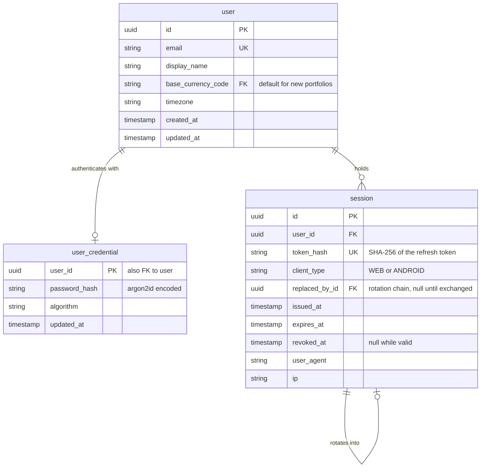

# Spec: `identity`

Module `identity` from [`CAPABILITY-MAP.md`](./CAPABILITY-MAP.md). Depends on:
nothing. Project-wide stack, commands, structure, style, testing and boundaries
are defined once in [`SPEC.md`](./SPEC.md) and are not repeated here.

---

## Objective

Establish who the user is, so every other module can scope data to an owner.

`identity` owns the `user` entity and the session lifecycle. It is the first
module because every other module's authorisation story reduces to "which user
is this request for" — and because `portfolio` and `catalog` are meaningless
without it.

**Explicitly not in scope for v1:** roles and permissions (there is exactly one
role), organisations or teams, MFA, password recovery via SMS. OIDC is planned
but deferred — the schema below is shaped so it lands additively. Assumption 2 in
`SPEC.md` says one owner per portfolio; this module encodes that and nothing more.

---

## Data Model

`identity` owns the user record and the whole authentication lifecycle. `user`
moved here from `ARCHITECTURE.md`; the other two tables are introduced by this
module.



### `user`

| Attribute | Type | Null | Description |
|---|---|---|---|
| `id` | uuid **PK** | N | |
| `email` | string(255) **UK** | N | Login identity |
| `display_name` | string(128) | N | |
| `base_currency_code` | char(3) **FK** → `currency` | N | Default for new portfolios |
| `timezone` | string(64) | N | |
| `created_at` | timestamp | N | |
| `updated_at` | timestamp | N | |

### `user_credential`

| Attribute | Type | Null | Description |
|---|---|---|---|
| `user_id` | uuid **PK**, **FK** → `user` | N | One credential row per user |
| `password_hash` | string(255) | N | argon2id encoded hash, parameters included |
| `algorithm` | string(32) | N | Recorded so hashes can be upgraded in place |
| `updated_at` | timestamp | N | |

Credentials are a separate table rather than columns on `user` for two reasons.
It keeps the hash out of every query that reads a user, making it impossible to
leak one by returning the other. And it is what makes OIDC additive: a user who
signs in through a provider simply has **no row here**, so adding an
`auth_identity` table later needs no migration of existing data and no nullable
password column pretending to be meaningful.

### `session`

One row per refresh token — that is, per logged-in device.

| Attribute | Type | Null | Description |
|---|---|---|---|
| `id` | uuid **PK** | N | Internal identifier; never sent to a client as a credential |
| `user_id` | uuid **FK** → `user` | N | |
| `token_hash` | char(64) **UK** | N | SHA-256 of the refresh token. The token itself is never stored |
| `client_type` | string(16) | N | `WEB` or `ANDROID`; determines transport, not privilege |
| `replaced_by_id` | uuid **FK** → `session` | Y | Set when this token is rotated; drives reuse detection |
| `issued_at` | timestamp | N | |
| `expires_at` | timestamp | N | Absolute expiry; no sliding window |
| `revoked_at` | timestamp | Y | Null while valid |
| `user_agent` | string(255) | Y | For a "signed-in devices" screen |
| `ip` | string(45) | Y | IPv6-length; personal data, see Open Questions |

**The refresh token is hashed, not stored.** A database leak must not hand over
live sessions. SHA-256 rather than argon2id is deliberate: the token is 256 bits
of server-generated randomness, so it is not brute-forcible and a deliberately
slow hash would add latency to every refresh for no security gain. Passwords are
low-entropy and chosen by humans, which is why they get argon2id instead.

---

## Authentication Design

**Access token: a short-lived JWT (15 minutes).** Stateless, so a request costs
no database round-trip and the API scales horizontally without shared session
state.

**Refresh token: a long-lived opaque random token (30 days), stored hashed.**
This is what makes revocation real. A pure stateless JWT cannot be withdrawn
before it expires, so logout, "sign out all devices" and a stolen Android phone
would all mean "wait for the token to lapse" — unacceptable for a system holding
a user's complete financial position. Revoking a session takes effect within one
access-token lifetime, which is the tunable trade-off.

This pair is also exactly what an OIDC provider issues, so adding OIDC later
slots into the same shape rather than replacing it.

**Rotation with reuse detection.** Every refresh issues a new token and sets
`replaced_by_id` on the old row. If an already-rotated token is presented again,
that is evidence of theft: revoke the entire chain for that user and force
re-authentication. Without rotation, a stolen refresh token is valid for its
full 30 days undetected.

**Signing: EdDSA (Ed25519) with a `kid` header.** Asymmetric rather than HS256
so that anything verifying a token needs only the public key, never the signing
key — the property that stops "we scaled out" from becoming a key-distribution
problem. `kid` makes key rotation possible without invalidating live tokens.
HS256 would be defensible while this is a single service; it is the choice that
becomes expensive to reverse.

**Claims:** `sub` (user id), `sid` (session id, for audit and forced-revocation
checks), `iat`, `exp`, `iss`, `aud`. Nothing else — a JWT is readable by anyone
holding it, so no personal data goes in it.

### Transport differs per client; the model does not

| | Access token | Refresh token |
|---|---|---|
| **Web** | In memory only — never `localStorage`, which is readable by any XSS | httpOnly, Secure, SameSite=Strict cookie, path-scoped to `/auth/refresh` |
| **Android** | In memory | Android Keystore / EncryptedSharedPreferences, sent in the request body |

The web refresh cookie is path-scoped so it is not attached to ordinary API
calls, which removes CSRF exposure from every endpoint except the refresh one.

---

## Decisions Taken

Recorded here because both were open questions in `SPEC.md`. See
`docs/adr/0003-jwt-access-tokens-with-refresh-sessions.md` for the full case.

**Q3 — Session strategy: JWT access tokens with server-side refresh sessions,**
as designed above. Supersedes the earlier cookie-session recommendation, which
assumed a web-only client; a native Android app has no cookie jar.

**Q4 — Registration: open self-service signup with email and password.**
Multi-user from the start, so ownership isolation is a real requirement rather
than a hypothetical one. Email verification is **not** in the first slice — it
needs an email provider the walking skeleton does not need — but open signup on
the public internet does need signup and login rate limiting from day one.
Verification is a tracked follow-up, not a silent omission.

**OIDC is a planned future addition, not a v1 feature.** The schema above is
shaped so it lands additively: a new `auth_identity` table
(`user_id`, `provider`, `provider_subject`, unique on the last two), no changes
to `user`, and no row in `user_credential` for provider-only accounts.

---

## API Surface

All responses are JSON. Register and login return an access token in the body
and open a session; the refresh token reaches the client by the transport its
`client_type` dictates.

| Method | Path | Purpose | Auth |
|---|---|---|---|
| `POST` | `/auth/register` | Create a user and open a session | No |
| `POST` | `/auth/login` | Authenticate and open a session | No |
| `POST` | `/auth/refresh` | Exchange a refresh token for a new pair, rotating it | Refresh token |
| `POST` | `/auth/logout` | Revoke the current session | Yes |
| `POST` | `/auth/logout-all` | Revoke every session for the user | Yes |
| `GET` | `/auth/sessions` | List the user's active sessions | Yes |
| `GET` | `/auth/me` | Current user profile | Yes |
| `PATCH` | `/auth/me` | Update `display_name`, `base_currency_code`, `timezone` | Yes |

Consumed by other modules through an exported `CurrentUser` decorator and an
`AuthGuard`. No other module reads the `user` table directly — that is the
boundary rule in `SPEC.md`.

---

## Acceptance Criteria

- [ ] A user registers with email + password and receives an access token plus a refresh token.
- [ ] Passwords are hashed with **argon2id** (or bcrypt with cost ≥ 12 if argon2 is unavailable). The hash never appears in any API response or log line.
- [ ] Email uniqueness is enforced by a **database unique constraint**, not only by an application check — proven by an integration test that attempts a duplicate insert directly.
- [ ] Login with a wrong password and login with an unknown email return the **same** error and take **indistinguishable** time. User enumeration through either channel is a defect.
- [ ] For a `WEB` client the refresh token is set as an `httpOnly`, `Secure`, `SameSite=Strict` cookie scoped to the `/auth/refresh` path, and never appears in a response body.
- [ ] The access token is a signed JWT carrying only `sub`, `sid`, `iat`, `exp`, `iss` and `aud` — no email, no display name, no personal data.
- [ ] A token signed with the wrong key, an unknown `kid`, or `alg: none` is rejected. Proven by a test that forges each.
- [ ] `POST /auth/refresh` rotates: the presented token is marked revoked with `replaced_by_id` set, and a new pair is issued.
- [ ] **Reuse detection** — presenting an already-rotated refresh token revokes the entire chain for that user. Proven by an integration test that replays a used token.
- [ ] `POST /auth/logout` revokes the session; the refresh token is rejected immediately afterwards and the access token stops working within its 15-minute lifetime.
- [ ] `POST /auth/logout-all` revokes every session for the user, not merely the calling one.
- [ ] The refresh token is stored only as a SHA-256 hash. A database dump contains no usable token — proven by asserting the raw value appears nowhere in the table.
- [ ] An expired or revoked session returns 401, never 500.
- [ ] `AuthGuard` rejects requests with no token, a malformed token, an unknown `sid`, or an expired one.
- [ ] `base_currency_code` is validated against the `currency` table and rejects unknown codes.
- [ ] Auth endpoints are rate-limited per IP. Open signup makes this a first-slice requirement, not a hardening task.
- [ ] Registration with an already-registered email returns the same generic response as a successful one, or is rate-limited hard enough not to be a usable enumeration oracle.

## Verification

```
npm test -- --selectProjects unit                       # hashing, session expiry logic
npm test -- --selectProjects integration                # unique constraint, session revocation
npm run test:e2e -- identity                            # full register -> login -> me -> logout
```

Manual: register two users, confirm each `GET /auth/me` returns only its own
record, and confirm the second cannot reuse the first's session cookie.

## Open Questions

- Access-token lifetime is set at 15 minutes and refresh at 30 days absolute,
  with no sliding window. Both are tunable; the pairing is what matters.
- Email verification before a user may create portfolios — deferred out of the
  first slice, but needed before any public deployment.
- Whether to store `user_agent` / `ip` on sessions at all — useful for a "sign
  out other devices" feature, but it is personal data with a retention cost.
- Password policy. Proposed: minimum 12 characters, no composition rules, checked
  against a common-password list.
