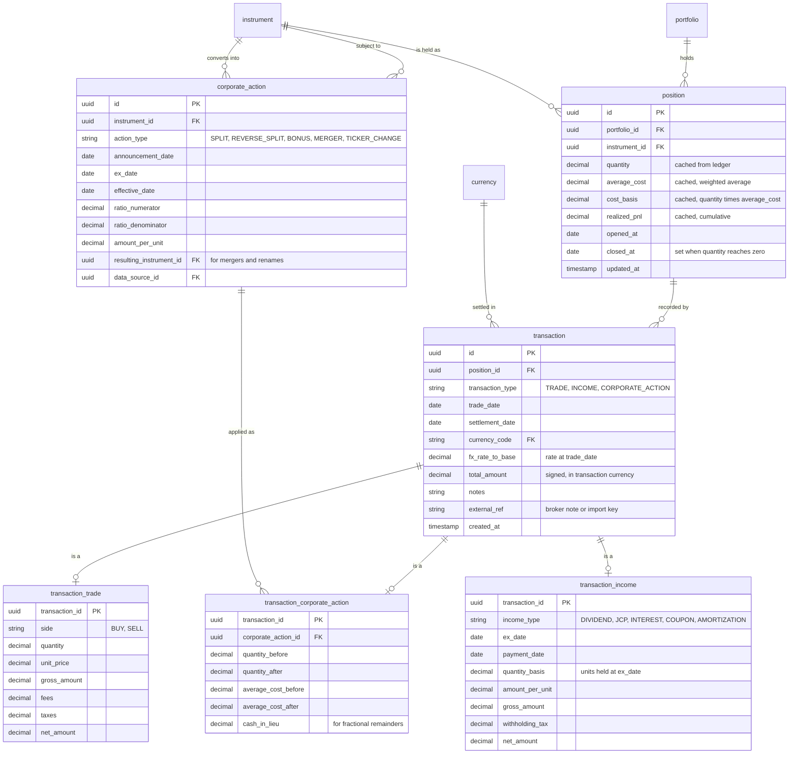

# Spec: `ledger`

Module `ledger` from [`CAPABILITY-MAP.md`](./CAPABILITY-MAP.md). Depends on:
`portfolio`, `catalog`. Project-wide stack, commands, structure, style, testing and boundaries
are defined once in [`SPEC.md`](./SPEC.md).

> **Status: data model only.** This module is not in the walking-skeleton plan
> ([`tasks/plan.md`](./tasks/plan.md)). Its entities and invariants are recorded
> here — moved out of `ARCHITECTURE.md` so they sit with the module that owns
> them — but its API surface, acceptance criteria and open decisions are not yet
> specified. Do not implement from this file; specify it first.

---

## Objective

Own what a portfolio actually holds and how it came to hold it: the transaction
ledger, the positions derived from it, and the cost-basis engine that keeps the
two consistent.

The ledger is the system's source of truth. `position` carries cached, derived
columns for query speed, but every one of them must be reproducible by replaying
transactions — a cached value that cannot be rebuilt is a bug, not an
optimisation.

**Not in scope:** prices and corporate-action *facts* (`market-data`), the
instruments themselves (`catalog`), daily valuation (`valuation`).

---

## Data Model

Moved here from `ARCHITECTURE.md`.



The second `instrument → corporate_action` edge is the `resulting_instrument_id`
reference — the security a holding converts into after a merger or ticker change.

The `transaction` base carries what every event shares: which position, when, in
what currency, at what FX rate. The subtype carries what only that event family
has. The transaction currency is stored per row rather than inherited from the
instrument, because fees and taxes are occasionally charged in a different
currency from the security itself.

Note the `fx_rate_to_base` snapshot on the transaction. The rate is captured at
trade date and frozen. Recomputing a historical purchase with today's rate would
silently change the past.

`corporate_action` appears above for context but is owned by `market-data`: it is
a market fact about an instrument. `transaction_corporate_action` — the
*application* of that fact to one position — is owned here. That two-level split
is what lets one split event fan out to every holder without duplicating it.

### Entity dictionary

Legend — **PK** primary key, **FK** foreign key, **UK** unique key.
Nullability: `N` = required, `Y` = optional.

### `position`

A portfolio's holding of one instrument. Created on the first transaction and
kept even after it is fully sold, so history survives.

| Attribute | Type | Null | Description |
|---|---|---|---|
| `id` | uuid **PK** | N | |
| `portfolio_id` | uuid **FK** → `portfolio` | N | |
| `instrument_id` | uuid **FK** → `instrument` | N | |
| `quantity` | decimal(24,8) | N | *Derived cache* — current units held |
| `average_cost` | decimal(20,6) | N | *Derived cache* — weighted average unit cost |
| `cost_basis` | decimal(20,6) | N | *Derived cache* — `quantity` × `average_cost` |
| `realized_pnl` | decimal(20,6) | N | *Derived cache* — cumulative, in instrument currency |
| `opened_at` | date | N | Date of the first transaction |
| `closed_at` | date | Y | Set when quantity reaches zero; cleared if rebought |
| `updated_at` | timestamp | N | |

Constraints: **UK** (`portfolio_id`, `instrument_id`) — one position per
instrument per portfolio. `quantity` must never be negative in v1 (no shorts).

The four cached columns exist only so a portfolio list renders without replaying
the ledger. They are recomputable from `transaction` at any time, and a
consistency job should verify them.

### `transaction`

The base event. Every change to a position goes through here.

| Attribute | Type | Null | Description |
|---|---|---|---|
| `id` | uuid **PK** | N | |
| `position_id` | uuid **FK** → `position` | N | |
| `transaction_type` | string(24) | N | Discriminator: `TRADE`, `INCOME`, `CORPORATE_ACTION` |
| `trade_date` | date | N | When the event occurred — drives ordering and FX |
| `settlement_date` | date | Y | When cash moved |
| `currency_code` | char(3) **FK** → `currency` | N | Currency of this event's amounts |
| `fx_rate_to_base` | decimal(20,10) | N | Rate to the portfolio's base currency at `trade_date`; `1` when already base |
| `total_amount` | decimal(20,6) | N | Signed net amount in `currency_code` |
| `notes` | string(512) | Y | |
| `external_ref` | string(128) | Y | Broker note number or import idempotency key |
| `created_at` | timestamp | N | |

Constraints: exactly one specialization row, matching `transaction_type`.
**UK** (`position_id`, `external_ref`) where `external_ref` is present, so
re-importing a broker file cannot duplicate events.

### `transaction_trade`

| Attribute | Type | Null | Description |
|---|---|---|---|
| `transaction_id` | uuid **PK / FK** → `transaction` | N | |
| `side` | string(8) | N | `BUY`, `SELL` |
| `quantity` | decimal(24,8) | N | Always positive; `side` carries the direction |
| `unit_price` | decimal(20,6) | N | |
| `gross_amount` | decimal(20,6) | N | `quantity` × `unit_price` |
| `fees` | decimal(20,6) | N | Brokerage, exchange, custody; default 0 |
| `taxes` | decimal(20,6) | N | Transaction taxes; default 0 |
| `net_amount` | decimal(20,6) | N | Buy: gross + fees + taxes. Sell: gross − fees − taxes |

### `transaction_income`

Dividends, JCP, coupons, interest payments, amortizations.

| Attribute | Type | Null | Description |
|---|---|---|---|
| `transaction_id` | uuid **PK / FK** → `transaction` | N | |
| `income_type` | string(24) | N | `DIVIDEND`, `JCP`, `INTEREST`, `COUPON`, `AMORTIZATION`, `RENT` |
| `ex_date` | date | Y | Entitlement date |
| `payment_date` | date | N | |
| `quantity_basis` | decimal(24,8) | N | Units held at `ex_date` |
| `amount_per_unit` | decimal(20,8) | Y | |
| `gross_amount` | decimal(20,6) | N | |
| `withholding_tax` | decimal(20,6) | N | Default 0 |
| `net_amount` | decimal(20,6) | N | `gross_amount` − `withholding_tax` |

Income never changes `quantity` or `average_cost`. It accumulates into realised
return, which is why yield can be reported separately from price appreciation.
`AMORTIZATION` is the exception worth flagging: a principal repayment reduces
cost basis rather than counting as income, and must be handled as such.

### `transaction_corporate_action`

The application of a market event to one holding.

| Attribute | Type | Null | Description |
|---|---|---|---|
| `transaction_id` | uuid **PK / FK** → `transaction` | N | |
| `corporate_action_id` | uuid **FK** → `corporate_action` | N | The market event applied |
| `quantity_before` | decimal(24,8) | N | |
| `quantity_after` | decimal(24,8) | N | |
| `average_cost_before` | decimal(20,6) | N | |
| `average_cost_after` | decimal(20,6) | N | |
| `cash_in_lieu` | decimal(20,6) | Y | Payment for fractional remainders |

Constraints: **UK** (`position_id` via `transaction`, `corporate_action_id`) — a
given action applies to a given position at most once. Storing before *and* after
values makes the adjustment auditable rather than requiring a replay to explain
why a quantity changed.

---

## Business Rules

The rules below are stated explicitly because each is quietly easy to get wrong,
and each is enforced by the cost-basis engine rather than by a database
constraint.

### Weighted-average cost basis

**On BUY:**

```
new_cost_basis  = cost_basis + (quantity × unit_price) + fees + taxes
new_quantity    = quantity + bought_quantity
new_average_cost = new_cost_basis / new_quantity
```

Acquisition costs are capitalised into the basis, not expensed.

**On SELL:**

```
proceeds       = (quantity × unit_price) − fees − taxes
realized_pnl  += proceeds − (average_cost × sold_quantity)
cost_basis    -= average_cost × sold_quantity
quantity      -= sold_quantity
average_cost   = unchanged
```

A sale never moves the average cost. It removes basis proportionally and books
the difference as realised P&L. When `quantity` reaches zero, set `closed_at`;
if the instrument is later rebought, clear `closed_at` and start the average
afresh from the new purchase.

### Corporate actions preserve total cost basis

For a split of ratio `numerator : denominator` (each `denominator` old units
become `numerator` new units), with `factor = numerator / denominator`:

```
quantity_after     = quantity_before × factor
average_cost_after = average_cost_before / factor
cost_basis         = unchanged
```

The invariant is that `cost_basis` is identical before and after. A reverse split
is the same formula with `factor < 1`. Fractional remainders that cannot be held
are settled through `cash_in_lieu` and reduce basis accordingly.

### Structural invariants owned here

- One `position` per (`portfolio`, `instrument`).
- `position.quantity ≥ 0` — no short positions in v1.
- Exactly one specialization row per `transaction`, matching `transaction_type`.
- A `position` may only reference an instrument that is public
  (`owner_user_id IS NULL`) or private to the same user who owns the portfolio.
- `transaction.trade_date` falls on or after `position.opened_at`, and for a
  fixed-income instrument, on or before its `maturity_date`.

---

## Worked Examples

Three scenarios traced through the model, confirming each is expressible without
inventing structure. Moved here from `ARCHITECTURE.md`.

### Two purchases of a stock

Buy 100 PETR4 at R$38.50 with R$4.90 in fees, then 50 more at R$41.00 with
R$4.90 in fees. Portfolio base currency BRL.

| Step | Rows written | Resulting position state |
|---|---|---|
| First buy | `position` (created), `transaction` (`TRADE`, BRL, fx 1.0), `transaction_trade` (`BUY`, qty 100, price 38.50, fees 4.90, net 3854.90) | qty 100, basis 3854.90, avg cost **38.5490** |
| Second buy | `transaction` + `transaction_trade` (`BUY`, qty 50, price 41.00, fees 4.90, net 2054.90) | qty 150, basis 5909.80, avg cost **39.398667** |

### A dividend, then a split

Continuing from above: a R$0.75/unit dividend on 150 units, then a 1:4 split
(each 1 share becomes 4).

| Step | Rows written | Resulting position state |
|---|---|---|
| Dividend | `transaction` (`INCOME`), `transaction_income` (`DIVIDEND`, basis 150, per-unit 0.75, gross 112.50) | qty 150, basis 5909.80, avg cost 39.398667 — **unchanged**; 112.50 accrues to income |
| 1:4 split | `corporate_action` (`SPLIT`, ratio 4:1) at instrument level; `transaction` (`CORPORATE_ACTION`) + `transaction_corporate_action` at position level | qty **600**, avg cost **9.849667**, basis **5909.80** — unchanged, as required by the corporate-action rule above |

### A foreign-currency crypto holding

Buy 0.15 BTC at USD 62,000 with USD 30 in fees, inside a BRL-base portfolio, on
a day when USD/BRL = 5.42.

- `instrument` (`CRYPTO`, currency `USD`) + `instrument_crypto` (`BTC`, network `BITCOIN`, decimals 8).
- `transaction` with `currency_code = USD` and `fx_rate_to_base = 5.42`, frozen at trade date.
- `transaction_trade`: qty 0.15, price 62000, fees 30, net **USD 9,330.00**.
- Position basis is USD 9,330.00; in base currency, **BRL 50,568.60**.
- Each day thereafter, `position_daily_snapshot` records `market_value_local`
  from `price_daily` in USD, and `market_value_base` using that day's `fx_rate` —
  so the BRL chart moves with both the BTC price and the exchange rate, which is
  the economically correct result.

---

---

## Not Yet Specified

Deliberately absent until this module is planned: API surface, acceptance
criteria, verification commands, and the module-level decisions each would
force. Writing them now would be inventing requirements ahead of the evidence
the walking skeleton is meant to produce.


## Open Questions

- FIFO / specific-lot tax accounting is out of scope (weighted average only).
  The ledger retains enough information to reconstruct lots retroactively, so
  this stays reversible — see `ARCHITECTURE.md` §9.
- Cash accounts are absent, so deposits and withdrawals cannot be distinguished
  from gains. This makes time-weighted return approximate and true IRR
  uncomputable. Confirm before any return-vs-benchmark reporting is promised.
