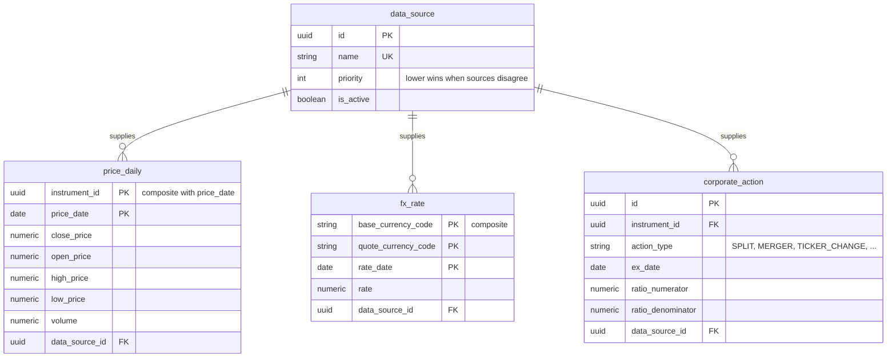

# Spec: `market-data`

Module `market-data` from [`CAPABILITY-MAP.md`](./CAPABILITY-MAP.md). Depends on:
`catalog`. Project-wide stack, commands, structure, style, testing and boundaries
are defined once in [`SPEC.md`](./SPEC.md).

> **Status: data model only.** This module is not in the walking-skeleton plan
> ([`tasks/plan.md`](./tasks/plan.md)). Its entities and invariants are recorded
> here — moved out of `ARCHITECTURE.md` so they sit with the module that owns
> them — but its API surface, acceptance criteria and open decisions are not yet
> specified. Do not implement from this file; specify it first.

---

## Objective

Own every externally sourced fact: closing prices, FX rates and corporate
actions, each carrying its provenance so two disagreeing sources can be
adjudicated rather than silently overwritten.

**Not in scope:** applying corporate actions to positions (`ledger`), computing
portfolio values (`valuation`).

---

## Data Model

Moved here from `ARCHITECTURE.md`.

`instrument` and `currency` are owned by `catalog`; they appear here only as the
targets of foreign keys.

### Entity dictionary

### `corporate_action`

The market fact, independent of who holds the security.

| Attribute | Type | Null | Description |
|---|---|---|---|
| `id` | uuid **PK** | N | |
| `instrument_id` | uuid **FK** → `instrument` | N | Affected security |
| `action_type` | string(24) | N | `SPLIT`, `REVERSE_SPLIT`, `BONUS`, `MERGER`, `TICKER_CHANGE`, `SPINOFF` |
| `announcement_date` | date | Y | |
| `ex_date` | date | N | |
| `effective_date` | date | N | |
| `ratio_numerator` | decimal(20,8) | Y | New units per `ratio_denominator` old units |
| `ratio_denominator` | decimal(20,8) | Y | |
| `amount_per_unit` | decimal(20,8) | Y | For cash components |
| `resulting_instrument_id` | uuid **FK** → `instrument` | Y | Target security for mergers and ticker changes |
| `data_source_id` | uuid **FK** → `data_source` | Y | |

Constraints: **UK** (`instrument_id`, `action_type`, `ex_date`).

### `price_daily`

One closing observation per instrument per trading day.

| Attribute | Type | Null | Description |
|---|---|---|---|
| `instrument_id` | uuid **PK / FK** → `instrument` | N | |
| `price_date` | date **PK** | N | Trading day |
| `open_price` | decimal(20,6) | Y | |
| `high_price` | decimal(20,6) | Y | |
| `low_price` | decimal(20,6) | Y | |
| `close_price` | decimal(20,6) | N | The one required value |
| `adjusted_close` | decimal(20,6) | Y | Back-adjusted for splits and dividends |
| `volume` | decimal(24,8) | Y | |
| `data_source_id` | uuid **FK** → `data_source` | N | |
| `ingested_at` | timestamp | N | |

Constraints: **PK** (`instrument_id`, `price_date`). Non-trading days simply have
no row — absence means "market closed", and valuation carries the last available
close forward.

### `fx_rate`

| Attribute | Type | Null | Description |
|---|---|---|---|
| `base_currency_code` | char(3) **PK / FK** → `currency` | N | |
| `quote_currency_code` | char(3) **PK / FK** → `currency` | N | |
| `rate_date` | date **PK** | N | |
| `rate` | decimal(20,10) | N | Units of quote per one unit of base |
| `data_source_id` | uuid **FK** → `data_source` | N | |

Constraints: **PK** (`base_currency_code`, `quote_currency_code`, `rate_date`);
`base_currency_code` ≠ `quote_currency_code`.

---

## Business Rules

**Daily close, not weekly.** Recorded here because it was an explicit open
question at the outset: daily granularity is stored, and weekly or monthly views
are downsampled at query time. Storing weekly would make daily views
unrecoverable; storing daily and aggregating is reversible.

**Fixed income needs no price row.** `price_daily` is optional for fixed income
and present only where a paper genuinely is marked to market. Valuation branches
on `instrument.is_variable_income`, never on whether price rows happen to exist —
see `SPEC-valuation.md`.

**Provenance is mandatory.** Every row carries `data_source_id`. When two sources
disagree for the same key, the lower `data_source.priority` wins. A fact with no
source is not ingestible.

---

## Not Yet Specified

Deliberately absent until this module is planned: API surface, acceptance
criteria, verification commands, and the module-level decisions each would
force. Writing them now would be inventing requirements ahead of the evidence
the walking skeleton is meant to produce.

## Open Questions

Both were `SPEC.md` open questions 1 and 2, and both block this module:

- **Which market-data provider**, and what are its rate limits and licensing
  terms? B3 publishes no free official EOD feed; crypto and FX are easier.
  Licensing may constrain redistribution.
- **Which index series supplies CDI, IPCA and SELIC** for fixed-income accrual?
  This is a hard dependency of `valuation`, not a nice-to-have.
