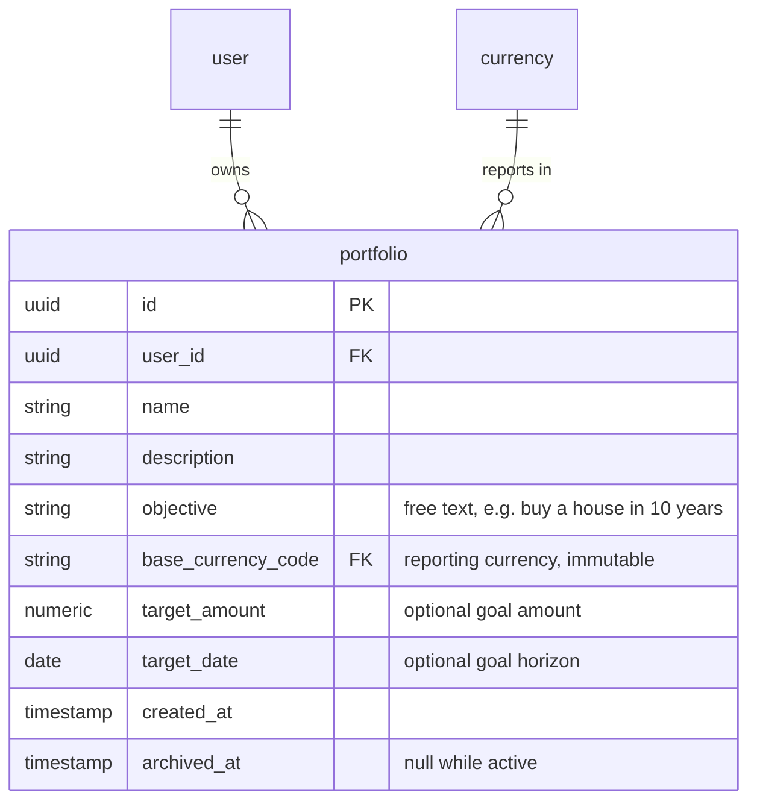

# Spec: `portfolio`

Module `portfolio` from [`CAPABILITY-MAP.md`](./CAPABILITY-MAP.md). Depends on:
`identity`. Project-wide stack, commands, structure, style, testing and
boundaries are defined once in [`SPEC.md`](./SPEC.md).

---

## Objective

Own the portfolio record — the container a user creates for a goal ("Faculdade
da Ana", "Aposentadoria") and the declaration of the currency its results are
reported in.

This module is deliberately small. It owns the portfolio row and its ownership
rules, and nothing else: positions belong to `ledger`, because they are derived
from transactions and the cost-basis engine maintains them
(see `CAPABILITY-MAP.md`, boundary decisions).

**Not in scope:** positions, holdings, transactions, valuations, allocation
targets, sharing.

---

## Data Model

`portfolio` owns exactly one table, moved here from `ARCHITECTURE.md`.



`user` is owned by `identity` and `currency` by `catalog`; both appear here only
as foreign-key targets.

### `portfolio`

| Attribute | Type | Null | Description |
|---|---|---|---|
| `id` | uuid **PK** | N | |
| `user_id` | uuid **FK** → `user` | N | Owner |
| `name` | string(128) | N | e.g. "Faculdade da Ana" |
| `description` | string(512) | Y | |
| `objective` | string(255) | Y | Free text, e.g. "buy a house in 10 years" |
| `base_currency_code` | char(3) **FK** → `currency` | N | Reporting currency, immutable after creation |
| `target_amount` | numeric(20,4) | Y | Goal amount, denominated in `base_currency_code` |
| `target_date` | date | Y | Goal horizon |
| `created_at` | timestamp | N | |
| `archived_at` | timestamp | Y | Null while active; archive rather than delete |

Constraints: **UK** (`user_id`, `name`).

**`objective` is free text, not an enum.** It exists for the person who owns the
portfolio, and the system never groups, filters or reports on it. "Buy a house
in 10 years" is as legitimate a goal as "retirement", and an enum would force it
into a `GENERAL` bucket that communicates nothing. Should grouped reporting ever
be wanted, it needs a deliberate taxonomy — not a repurposed description field.

**`target_amount` and `target_date` are independently optional.** A portfolio may
carry a goal amount with no deadline, a deadline with no amount, both or neither.
`target_amount` is denominated in `base_currency_code`, which is a further reason
that column is immutable: changing it would silently redenominate the goal.

### Constraints that carry real weight

**`base_currency_code` is immutable after creation.** Changing it would
invalidate every stored snapshot, since snapshots record values already converted
into that currency (see `SPEC-valuation.md`). The API rejects the change rather
than silently accepting it — a user who wants a different reporting currency
creates a new portfolio.

**Portfolios are archived, never deleted,** while any transaction references them.
`archived_at` is the soft-delete marker, and every default query filters
`archived_at IS NULL`.

**Not in scope:** positions, holdings, transactions and valuations belong to
`ledger`, because they are derived from transactions and maintained by the
cost-basis engine. Also out of scope: allocation targets and sharing.

---

## API Surface

| Method | Path | Purpose |
|---|---|---|
| `GET` | `/portfolios` | List the caller's active portfolios |
| `GET` | `/portfolios/:id` | One portfolio the caller owns |
| `POST` | `/portfolios` | Create |
| `PATCH` | `/portfolios/:id` | Update `name`, `description`, `objective`, `target_amount`, `target_date` |
| `POST` | `/portfolios/:id/archive` | Archive (soft delete) |
| `POST` | `/portfolios/:id/unarchive` | Restore |

All authenticated. `?includeArchived=true` on the list endpoint returns archived
portfolios too.

Exports a `PortfolioService.findOwnedById(userId, id)` for `ledger` to consume —
`ledger` never queries the `portfolio` table directly.

---

## Acceptance Criteria

- [ ] A user creates a portfolio with a name, objective and base currency, and it appears in their list.
- [ ] Every read and write is scoped by `userId` **in the `where` clause**, not checked after fetching (`SPEC.md`, Code Style).
- [ ] A user requesting another user's portfolio by id receives **404, not 403** — portfolio ids must not be enumerable.
- [ ] `PATCH` rejects any attempt to change `base_currency_code` or `user_id`, with a clear error naming the reason.
- [ ] `base_currency_code` is FK-validated against `currency` and rejects unknown codes.
- [ ] `(user_id, name)` is unique — a user cannot own two portfolios with the same name — enforced by a database constraint, proven by an integration test.
- [ ] The uniqueness constraint does **not** collide across users: two different users may each have a portfolio named "Retirement".
- [ ] Archiving sets `archived_at` and removes the portfolio from the default list without deleting the row; unarchiving restores it.
- [ ] `DELETE` is not implemented. Archive is the only removal path.
- [ ] `objective` accepts arbitrary text up to 255 characters, or null, and is never validated against a fixed list.
- [ ] `target_amount` and `target_date` are independently optional; setting either one alone is valid.
- [ ] `target_amount` rejects a negative value and is stored as `NUMERIC`, never as a float.

## Verification

```
npm test -- --selectProjects unit -- portfolio
npm test -- --selectProjects integration -- portfolio   # unique constraint, archive semantics
npm run test:e2e -- portfolio                           # ownership isolation, 404 on foreign id
```

**Walking-skeleton end-to-end check** — the criterion that proves the whole slice:

```
register user A  ->  login  ->  create portfolio "Retirement" (BRL)
                             ->  create a private CDB instrument
                             ->  GET /portfolios returns exactly that portfolio
register user B  ->  login  ->  GET /portfolios returns []
                             ->  GET /portfolios/<A's id> returns 404
                             ->  GET /instruments does not list A's CDB
```

When that passes, `identity` + `catalog` + `portfolio` are proven together and
`ledger` can begin.

## Open Questions

- Portfolio ordering in the list — user-defined sort order, or created-at? Only
  matters once a user has more than a handful.
