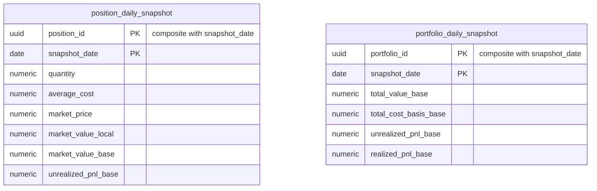

# Spec: `valuation`

Module `valuation` from [`CAPABILITY-MAP.md`](./CAPABILITY-MAP.md). Depends on:
`ledger`, `market-data`. Project-wide stack, commands, structure, style, testing and boundaries
are defined once in [`SPEC.md`](./SPEC.md).

> **Status: data model only.** This module is not in the walking-skeleton plan
> ([`tasks/plan.md`](./tasks/plan.md)). Its entities and invariants are recorded
> here — moved out of `ARCHITECTURE.md` so they sit with the module that owns
> them — but its API surface, acceptance criteria and open decisions are not yet
> specified. Do not implement from this file; specify it first.

---

## Objective

Turn the ledger and market data into a value per position and per portfolio, per
day — the series every chart in the product is drawn from.

**Not in scope:** the read APIs that serve those series to clients (`reporting`).

---

## Data Model

Moved here from `ARCHITECTURE.md`.

Both tables are **derived**. Dropping and rebuilding them from the ledger and
market data must produce identical results; nothing may live only here.

`position` and `portfolio` are owned by `ledger` and `portfolio` respectively.

### Entity dictionary

### `position_daily_snapshot`

Derived. Rebuildable from `transaction` + `price_daily` + `fx_rate`.

| Attribute | Type | Null | Description |
|---|---|---|---|
| `position_id` | uuid **PK / FK** → `position` | N | |
| `snapshot_date` | date **PK** | N | |
| `quantity` | decimal(24,8) | N | Units held on that date |
| `close_price` | decimal(20,6) | N | In instrument currency; carried forward on non-trading days |
| `market_value_local` | decimal(20,6) | N | `quantity` × `close_price` |
| `market_value_base` | decimal(20,6) | N | Converted at that date's FX rate |
| `average_cost` | decimal(20,6) | N | As of that date |
| `cost_basis_base` | decimal(20,6) | N | |
| `unrealized_pnl_base` | decimal(20,6) | N | `market_value_base` − `cost_basis_base` |
| `computed_at` | timestamp | N | |

### `portfolio_daily_snapshot`

Derived. The aggregate of that day's position snapshots, and the primary read
path for portfolio charts.

| Attribute | Type | Null | Description |
|---|---|---|---|
| `portfolio_id` | uuid **PK / FK** → `portfolio` | N | |
| `snapshot_date` | date **PK** | N | |
| `market_value_base` | decimal(20,6) | N | |
| `cost_basis_base` | decimal(20,6) | N | |
| `unrealized_pnl_base` | decimal(20,6) | N | |
| `realized_pnl_cumulative_base` | decimal(20,6) | N | |
| `income_cumulative_base` | decimal(20,6) | N | Dividends, coupons and interest to date |
| `daily_return_pct` | decimal(12,8) | Y | Day-over-day return, net of the day's flows |
| `computed_at` | timestamp | N | |

---

---

## Business Rules

### Fixed income is accrued, not marked to market

Variable-income instruments (`is_variable_income = true`) are valued from
`price_daily`. Fixed income has no meaningful daily close in the same sense; its
value on a given date is computed by accrual from `issue_date` using
`indexation_type`, `contracted_rate` / `index_percentage` and
`day_count_convention`, against the relevant index series.

`price_daily` rows are therefore *optional* for fixed income — useful when a paper
genuinely is marked to market (secondary-market government bonds), absent
otherwise. Valuation logic branches on `is_variable_income`, not on the presence
of price rows.

### Snapshots are derived and idempotent

No snapshot value may be the only place a fact lives. The nightly valuation job
must be safely re-runnable for any date range and must produce identical results
on re-execution given the same ledger and market data. A late-arriving price
correction or a backdated transaction triggers a recompute from that date
forward.

The same holds for the cached columns on `position`: authoritative state is the
ledger, and a periodic reconciliation should confirm the cache agrees with it.

---

## Open Questions

- Blocked on `SPEC-market-data.md`: without a CDI/IPCA/SELIC index series,
  fixed-income accrual cannot be computed at all.
- Cash accounts are absent, so time-weighted return is approximate and true IRR
  is unavailable. This constrains what `reporting` can honestly promise.
---

## Not Yet Specified

Deliberately absent until this module is planned: API surface, acceptance
criteria, verification commands, and the module-level decisions each would
force. Writing them now would be inventing requirements ahead of the evidence
the walking skeleton is meant to produce.

